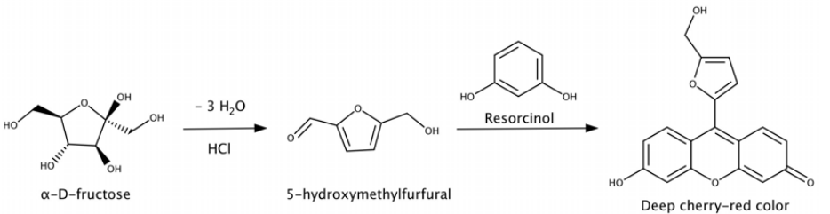
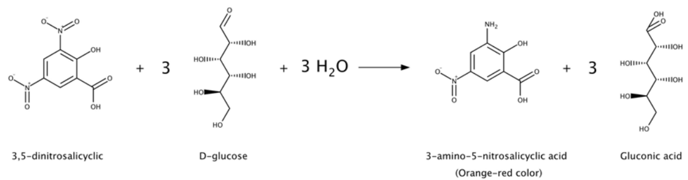
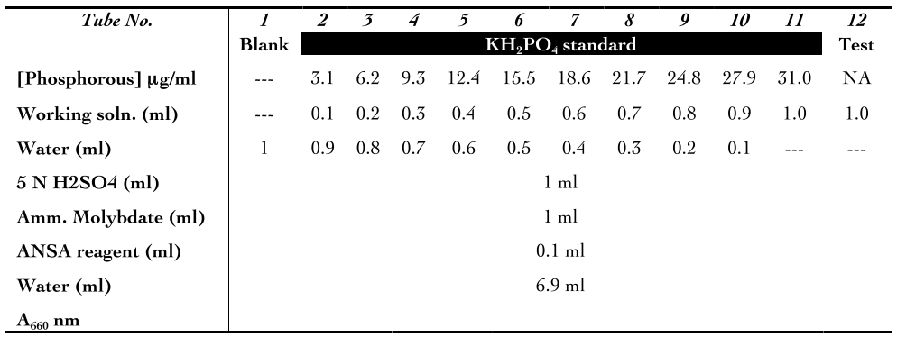
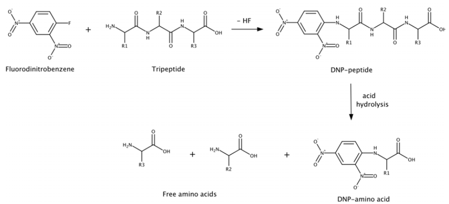

# Part 1: Qualitative & Quantitative Analysis 

## Carbohydrates

### Molisch Test

Molisch test is a group test for all carbohydrates either free or bound to proteins and lipids.

**Principle:** 
The reaction is based on the fact that concentrated acid catalyses the dehydration of sugars to form furfural (from pentoses) or hydroxymethyl furfural (from hexoses). Either of these aldehydes condenses with two molecules of napthol to form a purple or violet colored complex at the interface of the acid and test layer. If the carbohydrate is a poly- or disaccharide, a glycoprotein or a glycolipid, the acid first hydrolyses it into component monosaccharides, which get dehydrated to form furfural or its derivatives.

**Procedure:** 

1. Add 2-3 drops of α-napthol solution to 2 ml each of water (blank/negative control), 2% glucose solution (positive control) and test sample in a test tube and mix.
2. Hold the test tube in inclined position and gently add 1 ml H2SO4 along the wall of the test tube (do not mix).

**Note:**

1. Trioses and tetroses do not have the necessary five carbon atoms for furfural formation so they do not give positive result for this reaction.
2. Molish test is not a specific test for carbohydrates. Furfurals as such or furfural yielding substance, some organic acids like citric acid, lactic acid, oxalic acid, formic acid etc, can give a positive test.
3. A red ring may form if a concentrated sugar solution is used. This may be due to partial charring of the sugar by the acid. 
4. A black ring may form if conc. H2SO4 is not added very slowly. This can be due to the heat generated during the reaction, which can char the carbohydrates.
5. A green ring may form due to certain impurities in the reagent interacting with αnapthol and the acid.
6. α-napthol solution is unstable and should be prepared fresh. 
7. The test tube should be completely dry.

### Iodine Test

Iodine test is used to distinguish mono- or disaccharides from certain polysaccharides like amylose, dextrin and glycogen.

**Principle:**

Iodine test is based on the fact that polyiodide ions form colored adsorption complex with helical chains of glucose residues of amylose (blue-black), dextrin (purple) or glycogen (reddish-brown). Monosaccharides, disaccharides and branched polysaccharides like cellulose remain colorless. Amylopectin produces an orange-yellow hue. The reagent used in iodine test is Lugol’s iodine, which is an aqueous solution of elemental iodine and potassium iodide. Iodine on its own is insoluble in water. Addition of potassium iodide results in reversible reaction of the iodide ion with iodine to form triiodide ion, which further reacts with an iodine molecule to form pentaiodide ion. Bench iodine solution appears brown, whereas, the iodide, triiodide and pentaiodide ions are colorless. Many details of how exactly the color during this test is developed are still unknown. It is observed that the helix (coil or spring) structure of the glucose chain is the key to this test. Further, the resulting color depends on the length of the glucose chains. The triiodide and pentaiodide ions formed are linear and slip inside the helix structure. It is believed that transfer of charge between the helix and the polyiodide ions results in changes in the spacing of the energy levels, which can absorb visible light, giving the complex its color.

**Procedure:**

1. Add 2-3 drops of Lugol’s solution to 5 ml of solution to be tested. Note: 1. On heating, the blue color amylose-iodine complex disassociates but is formed again on cooling because the helical structure of amylose is disrupted, there by amylose loses its iodine binding capacity and the blue color. The blue color reappears on cooling due to the recovery of iodine binding capacity due to regaining of helical structure.
2. At very low pH amylose undergoes hydrolysis, so it is not recommended to conduct iodine test for amylose under these conditions.
3. The blue color amylose-iodine complex can be detected visually with concentrations of iodine as low as 20 µM at 20 °C.
4. The dextrin-iodine complex disassociates on heating but is not formed again on cooling because the concentration of residual iodine is too low to form complex with dextrin.
5. Presence of proteins (particularly albumin) in the sample may produce false positive results as proteins can compete with starch for binding iodine.

### Benedict’s Test 

Benedict’s test is used to differentiate between reducing and non-reducing sugars.

**Principle:** The carbohydrates having a free or potentially free, aldehyde or ketone group can act as a reducing agent. Benedict’s reagent appears deep blue in color and consists of copper sulphate mixed with sodium citrate and a weak alkali, sodium carbonate. When reducing sugars are heated in the presence of alkali they get converted to enediols, which are powerful reducing agents. Enediols reduce the cupric ions (Cu2+) present in the Benedicts reagent to cuprous ions (Cu+), which get precipitated as insoluble red colored cuprous oxide (Cu2O).The test is semi-quantitative, since the color of the precipitate indicates approximate quantity of the sugar present in the sample. For a sample containing reducing sugar the color of the sample during boiling progress from blue (with no reducing sugar present), green, yellow, orange, red, and then brick red or brown (with high concentration of reducing sugars). The citrate ions form a complex with cupric ions and prevent its precipitation with the hydroxide ions as cupric hydroxide. 

**Procedure:**

1. Add 0.5-1.0 ml of the test solution to 2 ml of Benedict’s reagent. 
2. Keep the test tubes in boiling water bath for 4-10 min. 

**Note:**

1. Sucrose, starch, inositol gives negative result, whereas lactose and maltose give positive result with Benedict’s reagent.
2. Benedict modified the Fehling’s solution to make an improved single reagent, which is quite stable. It is very sensitive to even small quantities of reducing sugars (0.1%) and yields enough precipitate.
3. False positive reaction for urine sample may be obtained due to presence of reducing substances like uric acid, ascorbic acid (during vitamin supplementation), drugs (levodopa) etc
4. A greenish precipitate indicates about 0.5 g% concentration; yellow precipitate indicates 1 g% concentration; orange indicates 1.5 g% and red indicates 2 g% or higher concentration.

### Barfoed’s Test 

Barfoed’s test is used to detect reducing monosaccharides in the presence of disaccharides.

**Principle:** Barfoed’s reagent consists of copper acetate in dilute acetic acid. Since acidic pH is unfavorable for reduction, monosaccharides, which are stronger reducing agents, react in about 1-2 min, whereas reducing disaccharides take 7-12 min to first get hydrolyzed in the acidic solution and then react. A thin red precipitate is formed at the bottom or sides of the tube. Thus, the difference in reducing strength can be detected.

**Procedure:**

1. Add 3 ml of Barfoed’s reagent to 1 ml of sample. 
2. Keep the test tubes in boiling water bath for 1-2 min only.

**Note:**

1. The boiling should not exceed 1-2 min, otherwise reducing disaccharides may be hydrolyzed and give a positive test result.
2. The disaccharide solutions used for this test should not exceed 1% (w/v).
 
|Glucose | Fructose  | Xylose|Sucrose|Maltose|Galactose|
|------:|:---------:|:-----------:|:-------:|:---------:|:----:|
|**Upto 2 min**     |    +    |     +     |    +  |    -    |-|-|
|**After 7-12 min** |    +    |     +     |    +  |    +    |+|+|

Higher concentration (≥ 5%) gives positive result for disaccharides with Barfoed’s test.
3. Chloride ions interfere with this test. Since urine contains chloride ions Barfoed’s test is not suitable for detection of reducing sugars in urine.

### Seliwanoff’s Test

Seliwanoff’s test is a timed color reaction specific for ketohexoses. It is used to distinguish ketoses from aldoses.

**Principle:** The reagent consists of resorcinol and conc HCl. The acid hydrolyses of polysaccharides and oligosaccharides yields simpler sugars. Ketohexoses undergo dehydration to yield 5-hydroxymethyl furfural more rapidly than aldohexoses. The dehydrated ketose reacts with resorcinol to produce a deep cheery red color complex (not precipitate). Aldoses may react slightly to produce a faint pink to cherry red color.

**Procedure:**

1. Add 2 ml of Seliwanoff’s reagent to 1 ml of sample. 2. Keep in boiling water bath for 1 min. Note: 1. Sucrose and inulin also give this test because these are hydrolysed by acid to give fructose.
2. High concentration of glucose or other sugar may interfere by producing similar colored compounds with seliwanoff reagent.
3. Prolonged boiling can transform glucose to fructose by catalytic action of acid and form cherry red complex.

### Osazone Test 

Osazone test is used to detect reducing sugars.

**Principle:** The reagent consists of phenylhydrazine in acetate buffer. Carbohydrates with free or potentially free carbonyl groups react with phenylhydrazine to form osazone. The condensation-oxidation-condensation reaction between three molecules of phenylhydrazine and carbon one and two of aldoses or ketoses to yields 1,2-diphenyhydrazone, which are known as osazone. Osazone appear as yellow colored crystals of characteristic shape, solubility, melting point and time of formation. Since both carbons 1 and 2 are involved in the reaction C-2 epimers produce the same osazone. Ketoses with configurations identical to aldoses below C-2 give the same osazones e.g. glucose and fructose.

The characteristic features of osazone are given in the following table:

|Carbohydrate (osazone)|Time of formation (min)|Crystalline structure|
|:----:|:----:|:---:|
|Fructosazone |2|Needle shape |
|Glucosazone |5|Needle shape|
|Galactosazone|20| Thorny ball shape |
|Maltosazone |30-45|Sunflower/Star shape|
|Lactosazone|30-45|Cotton ball/Powder puff shape|

**Procedure:**

1. Add 0.3 g of osazone mixture and 5 drops of glacial acetic acid to 5 ml of sample in each of the test tubes and mix well (warm gently if required to dissolve the contents).
2. Keep the test tube in boiling water bath and observe for formation of crystal at various time points indicated in the observation table.
3. Observe the shape of the crystal under low magnification. 

**Note:**
1. This is the only test to distinguish lactose from maltose during identification of unknown sugars.
2. Sucrose is a non-reducing sugar but it forms osazone on boiling for 30 min. Maltose and Lactose form osazone after boiling the sample for more than 2 hrs.
3. Osazones of monosaccharides are insoluble in hot solution unlike those of disacchrides. 
4. After incubating the tubes in boiling water bath for 30 min, the osazone solution should be allowed to cool gradually to room temperature to facilitate proper formation of the crystals. Tubes should not be cooled under running tap water or on ice.
5. Sodium acetate and acetic acid together function as acetate buffer and maintain the pH at 5, which is proper for the formation of osazones. If excess acetic acid is added, the pH of the reaction reduces further resulting in the hydrolysis of disaccharides to monosacharides, which then form osazones insoluble in hot solution.

### Athrone Test

Anthrone method is a group test for carbohydrates. It is a rapid and convenient method for quantification of carbohydrates either free or bound to proteins and lipids.

**Principle:** If the carbohydrate is a poly- or disaccharide, a glycoprotein or a glycolipid, the concentrated acid present in anthrone reagent first hydrolyses it into component monosaccharides. Further the concentrated acid catalyses the dehydration of sugars to form furfural (from pentoses) or hydroxymethyl furfural (from hexoses). Either of these aldehydes condenses with two molecules of napthol to form a bluish green complex, which is quantified by measuring absorbance at 620 nm in a spectrophotometer or using red filter in a colorimeter.

**Reagents:** Dissolve 2 g anthrone in 50 ml conc. H2SO4, makeup to 100 ml with conc. H2SO4.

**Procedure:** 

1. Setup and process the standard (glucose), blank and unknown sample as described in the table below.

2. Measure absorbance at 620 nm in spectrophotometer or in colorimeter using red filter. Use the blank to set absorbance to zero then measure absorbance of each tube.
3. Plot a standard curve using absorbance values of serial dilutions of glucose. (X-axis: sugar concentration in µg/ml; Y-axis: absorbance at 620 nm). Based on the standard curve determine carbohydrate content in unknown sample.

**Note:**

1. Anthrone test is not a specific test for carbohydrates. Furfurals as such and furfural yielding substance, some organic acids like citric acid, lactic acid, oxalic acid, formic acid etc, can give a positive test.
2. If the sample contains proteins with large number of tryptophan residues, the reaction produces red color.

### Dinitrosalicylic acid Method

Dinitrosalicylic acid (DNSA) method is used for estimating the concentration of reducing sugars in a sample.

**Principle:** The carbohydrates having a free or potentially free, aldehyde or ketone group can act as reducing agents. The DNSA reagent is an alkaline solution of 3,5dinitrosalicyclic acid and tartarate salt. On heating the reducing sugars can reduce 3,5dinitrosalicyclic acid to 3-amino-5-nitrosalicyclic acid, which appears orange-red in color. The intensity of the color is proportional to amount of reducing sugar present in the sample. The orange color developed is compared to standards in a spectrophotometer at 540 nm.

**Reagents:** Dissolve 30 g potassium sodium tartarate in 50 ml water and add 20 ml 2 M NaOH. Mix well, add 1 g DNSA powder and make up to 100 ml with H2O

**Procedure:**

1. Setup and process the standard (glucose), blank and unknown sample as described in the table below.

2. Measure absorbance at 540 nm in spectrophotometer. Use the blank to set absorbance to zero then measure absorbance of each tube.
3. Plot a standard curve using absorbance values of serial dilutions of glucose. (Xaxis: sugar concentration in µg/ml; Y-axis: absorbance at 540 nm). Based on the standard curve determine carbohydrate content in unknown sample.

**Note:**

1. Different sugars give different color yields. The method is therefore not suitable for the determination of a complex mixture of reducing sugars.
2. The DNSA method is simple, sensitive and adaptable to large sample size.

### Roe’s method

The Roe’s method is a modified Selod and is generally used to determine the concentration of fructose in a given sample.

**Principle:** Ketosugars undergo rapid dehydration to hydroxymethyl furfural than aldo sugars. The hydroxymethyl furfural formed later condenses with resorcinol to give a pink colored complex (λmax
520 nm).

**Reagents:** (i) Standard fructose stock solution (1 mg/ml): weigh 100 mg of fructose and transfer it into a 100 ml volumetric flask. Make up the volume to 100 ml with distilled water. (ii) Working standard fructose solution (100 µg/ml): dilute 10 ml of the stock solution to 100 ml with distilled water in a volumetric flask. (iii) Resorcinol reagent: resorcinol (0.1% w/v) and thiourea (0.25% w/v) in glacial acetic acid. (iv) Dilute HCl: mix concentrated hydrochloric acid and distilled water in the ratio of 5:1 

**Procedure:**

1. Setup and process the standard (glucose), blank and unknown sample as described in the table below.

2. Measure absorbance at 520 nm in spectrophotometer. Use the blank to set absorbance to zero then measure absorbance of each tube.
3. Plot a standard curve using absorbance values of serial dilutions of fructose. (Xaxis: sugar concentration in µg/ml; Y-axis: absorbance at 520 nm). Based on the standard curve determine carbohydrate content in unknown sample (remember to take the dilution factor into account).

### Fehling’s test 

Fehling’s test is used to differentiate between reducing and non-reducing sugars.

**Principle:** The carbohydrates having a free or potentially free, aldehyde or ketone group can act as reducing agents. Fehling’s reagent appears deep blue in color and consists of copper sulphate mixed with potassium sodium tartarate and a strong alkali, usually, sodium hydroxide. On heating the sample in presence of Fehling’s solution, bistartarocuprate(II) complex oxidizes the aldoses to corresponding aldonic acids, and in the process the copper(II) ions of the complex are reduced to insoluble yellow or red color precipitate of cuprous(I) oxide(Cu2 yield shorter chain acids. 

The tartarate ions prevent the formation of insoluble Cu(OH)2 from the reaction of CuSO4.5H2O and NaOH present in the solution by forming bistartaratocuprate(II) complex. This complex releases cupric ions slowly for reduction thus preventing the formation of black cupric oxide. If Fehling’s solution is heated in the absence of reducing sugars it forms black precipitate of cupric oxide.

**Reagents:** Fehling’s solution A- Dissolve 7.0 g of CuSO4 .7H2O in 100 ml H2 O. Fehling’s solution B- Dissolve 24.0 g of KOH and 34.6 g of potassium sodium tartarate in 100 ml H2O. Fehling’s reagent- Mix equal volumes of A and B solution just before use.

**Procedure:**

1. Add 1 ml of Fehling’s reagent to 1 ml of test solution and mix well. 
2. Place the test tube in boiling water bath for 2-3 min. 

**Note:**

1. Fehling’s test gives positive result for aldo monosaccharides (due to presence of oxidizable aldehyde group) and also for keto monosaccharides, since they are converted to aldoses by the base in the reagent.
2. Sucrose does not react with Fehling’s reagent because the anomeric carbon of glucose is involved in glycosidic bond formation (free form of aldehyde is not present). Lactose and Maltose are reducing sugars. The reducing sugars e.g. glucose get oxidized because glucose exists in aqueous solution in three different forms (two cyclic and one noncyclic). The non-cyclic is the least common but it is present in small amount. This form has an aldehydic group at the end of the chain and is the group that is oxidized. As the aldehyde form gets oxidized, more of the non-cyclic form is produced due to Le Chatelier's principle.
3. Fehling’s is used to determine dextrose equivalents for the conversion of starch to glucose syrup.
4. Compounds other than reducing sugars also test positive to this test, e.g. chloroform, ammonium salts. Formic acid is readily oxidized to carbon dioxide and water and gives positive Fehling’s test result.
5. Fehling’s can be used to screen for glucose in urine, to detect diabetes. Since cuprous oxide is dissolved by ammonia, it is not possible to detect small quantities of reducing sugars in fluids like urine, which are saturated with ammonia.

### Somogyi-Nelson method

Somogyi-Nelson method is used for quantitative determination of relatively pure sample of reducing sugars.

**Principle:** The carbohydrates having a free or potentially free, aldehyde or ketone group can act as reducing agents. Alkaline copper tartarate is the active reagent in SomogyiNelson method. When a reducing sugar is heated in an alkaline solution of copper tartarate, cuprous oxide is produced, which in turn reacts with arsenomolybdate to give molybdenum blue. The blue color developed is compared to standards in a spectrophotometer at 620 nm. The presence of sodium sulfate in the reaction mixture prevents reoxidation of cuprous oxide by atmospheric oxygen. Reagents: Dissolve 1.5 g copper sulfate in a small volume of distilled water. Add one drop of sulfuric acid and make up to 10 ml. 

**Procedure:**

1. Add 1 ml alkaline copper reagent to each of the 1 ml standard, blank and sample. 
2. Place the tubes in a boiling water bath for 10 min. 
3. Let the tubes cool down, then add 1 ml arsenomolybdate reagent. 
4. Make up the volume to 10 ml with water. 
5. After 10 min, read the absorbance at 620 nm. 

**Note:**

1. Since different reducing sugars produce blue colored product of various intensities, this method is not suitable for mixture of reducing sugars.
2. Proteins interfere with this reaction. Samples can be deproteinated by zinc hydroxide precipitation.

### Mucic acid test 

Mucic acid test is used to detect the presence of galactose.

**Principle:** Monosaccharides upon treating with strong oxidizing agents such as nitric acid yield saccharic acids. Nitric acid has the capacity to xidize both aldehyde and primary alcoholic groups present at C1 and C6 respectively of galactose to yield an insoluble precipiate (rod shaped crystals) of mucic acid and thus the name of the test. Galactose containing saccharides test positive to this reaction.

**Reagent:** conc. Nitric acid. Sugar solution: galactose (2% w/v in distilled water).

**Procedure:**

1. Add 2 ml of conc. nitric acid slowely to 5 ml of the galactose solution in a small beaker. 
2. Heat over a flame (cautiously) till the volume is reduced to about 2-3 ml. 
3. Gradually cool the solution to room temperature.

## Amino acids

### Ninhydrin Test (Qualitative)

Ninhydrin test is commonly used to differentiate carbohydrates from amino acids. This test is also useful in quantitative determination of amino acids in a given sample.

**Principle:** This assay is based on the fact that two molecules of ninhydrin (2,2 dihydroxyindane-1, 3-dione) react with a free alpha-amino acid to produce a deep blue or purple color known as Ruhemann’s purple. In this reaction ninhydrin acts as an oxidizing agent and causes the deamination and decarboxylation of the amino acids at elevated temperature, which is followed by condensation between reduced ninhydrin molecules, released ammonia and second molecule of ninhydrin, to form the blue-purple complex (λmax 570 nm). The intensity of the formed complex is proportional to the concentration of amino acids in the solution.

**Procedure:** Add few drops of ninhydrin reagent to 1 ml of amino acid solution and mix. Place the tubes in boiling water bath for 5 min and then allow cooling to room temperature. 

**Note:** 
1. Ninhydrin reacts with proline, a secondary amine, to yield an iminium salt, which is yellow-orange in color.

2. Ninhydrin test is quite sensitive (~ 0.5 nmol). Ninhydrin is commonly used to detect fingerprints, since the terminal amines of lysine residues in peptides and proteins shed off in fingerprints react with ninhydrin.

### Ninhydrin Test (Quantitative)

**Principle:** Same as described in experiment 13. 

**Reagent:** Dissolve 0.35 g ninhydrin in 100 ml ethanol. (iso-propanol or 1:1 mixture of acetone/butanol may be used instead of ethanol). Diluent solvent: Mix equal volumes of water and n-propanol. 

**Procedure:**

1. Setup and process the standard (amino acid), blank and unknown sample as described in the table below.

2. Measure absorbance at 570 nm (440 nm for proline and hydroxyproline) in spectrophotometer. The color is stable for 1 h. Use the blank to set absorbance to zero then measure absorbance of each tube.
3. Plot a standard curve using absorbance values of serial dilutions of alanine. (X-axis: amino acid concentration in µg/ml; Y-axis: absorbance). Based on the standard curve determine amino acid content in unknown sample.

**Note:**
1. The color intensity developed by reaction of amino acids with ninhydrin depends on type of amino acid.
2. Ninhydrin is also used in solid phase peptide synthesis to monitor deprotection for amino acid analysis of proteins.
3. Allow all the samples to cool down to room temperature since the same sample at different temperatures often shows different color intensity. Also, maintain consistent volume.

### Isatin Test

**Principle:** Imino acids such as proline and hydroxyproline react with isatin (1H-indole2,3-dione) under acidic conditions to yield a blue colored adduct.

**Procedure:**

1. Apply a drop of imino acid solution on a whatmann no 1 filter paper strip (size 25x50 cm) and dry the spot using a hot air gun/hair dryer or hot air oven.
2. Apply a drop of isatin reagent on the dried spot. Repeat the drying procedure with hot air gun for a few minutes and observe.
3. Appearance of a characteristic blue colored spot on the filter paper confirms the presence of imino acid. Other amino acids give pink color with this reagent.

### Xanthoprotic Test
Xanthoprotic test is used to determine presence of aromatic amino acids like tyrosine and tryptophan.

**Principle:** This test is based on the fact that aromatic groups in the amino acids are nitrated by heating with concentrated HNO3 to yield intensely yellow colored nitro derivative. In the presence of alkali, a salt of the tautomeric form of the nitro compound is formed, which has an orange color.

**Procedure:**

1. Add 0.5 ml conc. Nitric acid to 0.5 ml of amino acid solution and mix. 2. Let the tube cool to room temperature (appearance of yellow color indicates aromatic amino acid).
3. Add NaOH till yellow color is converted to orange color. 

**Note:**
In phenylalanine the phenyl group is very stable, therefore it doesnot react with nitric acid in conditions of this test.

### Pauly’s diazo test 
Pauly’s diazo test is used to detect the presence of tyrosine or histidine. 

**Principle:** Sulfanilic acid upon diazotization in the presence of sodium nitrite and hydrochloric acid results in the formation of p-phenyldiazosulphonate. The diazonium salt formed couples with histidine in alkaline medium to form a dark cherry-red color, which retains its tint on dilution and changes to orange when the solution is made acidic. Tyrosine also gives a red color but this becomes yellow on dilution and bronze-yellow on acidification. One mole of histidine or tyrosine reacts with 2 moles of the diazonium compound to produce one mole of bis(azobenzenesulphonic acid)histidine or bis(azobenzenesulphonic acid)tyrosine.

**Procedure:**

1. Add few drops of pre-chilled sodium nitrite to 1 ml of chilled sulfanilic acid and vortex. 
2. Immediately add few drops of pre-chilled amino acid solution and vortex. 
3. Add drop wise sodium carbonate solution till color begins to appear. 

**Note:** Histidine gives a negative test with Millon’s reagent.

### Sakaguchi Test 
The Sakaguchi test detects the presence of guanidinium group of arginine in proteins.

**Principle:** Sakaguchi reagent is composed of 1-naphthol and a drop of sodium hypobromite. The guanidine group in arginine reacts with Sakaguchi reagent to form a red colored complex (due to the formation of an indophenol-like structure). The exact mechanism of this reaction is not yet known.

**Procedure:**

1. Add 1 ml NaOH and 2 drops of α-napthol to 2 ml test solution. Mix well. 
2. Add 4-5 drops of bromine water and observe for red color.

### Millon’s Test 
Millon’s test is a specific test for tyrosine.

**Principle:** The reaction is based on the fact that the hydroxybenzene radical of tyrosine reacts with Millon’s reagent, which constitutes acid mercuric sulphate and sodium nitrite to yield a red color complex.

**Procedure:** 

1. Add 12 ml of Millon’s reagent to 2 ml test solution. 
2. Keep in boiling water bath for 10 min. 
3. Cool under running tap water and add 1 ml of 1% NaNO2 required.

**Note:** Proteins give a white precipitate with Millon’s reagent on heating. On addition of sodium nitrate the precipitate turns pink red.

### Ehrlich Test 
Ehrlich test is a specific test for tryptophan.

**Principle:** This reaction is based on the fact that under acidic conditions the Ehrlich’s aldehyde reagent (p-dimethyaminobenzaldehyde) undergoes electrophilic substitution reaction at the indole (a benzyl pyrrole) ring of tryptophan to yield a blue-violet condensation product.

**Procedure:** Add 2 ml Ehrlich’s reagent to 0.5 ml test solution and observe the tube for color change.

### Nitroprusside Test 

Nitroprusside test is used to detect presence of free –SH groups, cystein in a protein. 

**Principle:** Reaction of cystein with sodium nitroprusside, Na2 Fe(CN)5 NO.2H2O, in ammonical solution will give a purple or brown product, a complex anion in which an octohedral ferrous center is surrounded by five tightly bonded cyanide groups. Many proteins that give a negative test may exhibit a positive test after heat coagulation or denaturation, indicating the liberation of free –SH groups.

**Procedure:**

1. Add 0.5 ml sodium nitroprusside to 2 ml test solution. 
2. Add 0.5 ml ammonium hydroxide solution.

### Sullivan and McCarthy’s Test 

Sullivan and McCarthy’s test is used for detection of methionine.

**Principle:** Addition of sodium nitroprusside to an alkaline solution of 
methionine followed by acidification of the reaction yields a red color. This reaction also forms the basis for the quantitative determination of methionine. 

**Procedure:** 

1. Add few drops of sodium hydroxide (5 N) to 1 ml of the test solution. 
2. Add few drops of glycine (2%) and 10% sodium nitroprusside solution and vortex. 
3. Place the test tube at 40°C for 15 min in a water bath. 
4. Incubate the tube in ice cold water for 5 min and add 0.5 ml of 6 N HCl. 
5. Vortex the contents and allow to stand at room temperature for 15 min. Observe for color change.

### Hopkins-Cole Test
The Hopkins-Cole reaction, also known as the glyoxylic acid reaction, is a specific test used for detecting the presence of the indole ring and thus tryptophan in proteins.

**Principle:** The test is based on the fact that layering concentrated sulfuric acid over a mixture of protein with Hopkins-Cole reagent (containing glyoxylic acid) results in the formation of a violet-purple ring at the interface of the liquids.

**Reagents:** 0.1% amino acid solution. Glyoxylic acid: Expose glacial acetic acid to sunlight for a few days. 

**Procedure:**

1. Add 2 ml light exposed glacial acetic acid to 2 ml of test solution. 
2. Add conc. H2SO4 along the sides of the tube held in slanting position so that distinct phases are formed. 

**Note:** Nitrites, chlorates, nitrates and excess chlorides prevent the reaction from occurring. 

### Lead acetate Test 
The lead acetate test is a specific test for cysteine and cystine.

**Principle:** In a strongly alkaline environment cysteine release sulfide ions, which react with lead acetate to form black lead sulfide.

**Reagents:** 2% (w/v) lead acetate solution in water, 40% NaOH. 

**Procedure:** 

1. Add few drops of lead acetate solution to 2 ml of amino acid solution. 
2. Add few drops of 10% NaOH. 
3. Heat and allow standing for 5 min. 

**Note:**
1. This test is not answered by methionine because the sulfur, involved in thioester linkage, is not released by treatment with NaOH.
2. Addition of excess lead acetate solution will result in white precipitate.

### Gerngross test 
Gerngross test is used for detection of tyrosine.

**Principle:** 1- nitroso-2-napthol reacts with tyrosine in acid medium to give a purple-red colored complex. 

**Reagents:** Nitrosonapthol (0.1% w/v) in ethanol, conc. Nitric acid, 0.1% (w/v) tyrosine in distilled water (adding few drops of 6 N hydrochloric acid). 

**Procedure:**

Take 1ml of the amino acid solution in a test tube and add few drops of nitrosonapthol and vortex. Boil the contents over a bunsen flame for 3-5 min. Cool the contents under running tap water and add 1-2 drops of nitric acid. 

**Note:** Histidine gives a negative gerngross test.

### Amino acids Titration Curve 

**Principle:** Amino acids have the general formula NH2 -CHR-COOH.Amino acids can exist as ampholytes (can act both as an acid, a proton donor or a base, a proton acceptor) or zwitterions (dipolar ion) in solution, depending on the pH of the solution. The pH at which an amino acid carries no net charge is known as its isoelectric point (pI) or isoelectric pH. At isoelectric point all the groups in the amino acid are ionised such that the molecule carries no net charge. Therefore at its isoelectric point the amino acid will not exhibit mobility in an electrical field. Solubility and buffering will also be at its minimum. If a solution of an amino acid at its isoelectric point is titrated with hydrochloric acid (addition of protons) a certain pH is reached where 50% of the molecules are in cation form and 50% in zwitterion form. This pH is pK1 further protons are added to the solution, more molecules become cationic in nature and solubility increases. Alternatively, a solution of an amino acid at its isoelectric point is titrated with NaOH (addition of base/ removal of protons) a certain pH is reached where 50% of the molecules acquire the anion form and 50% remain in zwitterion form. This pH is pK2 –NH2 group). (with regard to The isoelectric pH for monoamino-monocarboxylic amino acids can be calculated from the equation: pI = (pK1 + pK2)/ 2. It is therefore evident that the buffering action of amino acid solution is greatest at and around pK1 or pK2 and minimum at pI.
There are correspondingly more pK values for amino acids having more than two ionizable groups. The buffering capacity of plasma proteins and hemoglobin is largely due to histidine residues. Since the pK value of imidazole group of histidine is 6.1 it acts as an effective buffer at the physiological pH of 7.4. 

**Reagents:** Prepare 0.1 M HCl, 0.1 M NaOH, 0.1 M glycine, 0.1 M histidine, 0.05 M lysine and 0.05 M glutamate solutions. 

**Procedure:**

1. Titrate 10 ml of glycine solution against 0.1 M HCl. Keep track of the pH change at fixed intervals (evry ml of acid added) using a pH meter. Continue titrate till the pH of the sample reaches 1.3.
2. Perform a separate titration of 10 ml glycine against 0.1 M NaOH till pH of 12.5 is attained. Record pH change at regular intervels.
3. Plot the titration curve by taking the volume of acid/alkali added on the X-axis and the pH attained on the Y-axis. Note the two plateaus on the curve where despite the addition of acid/alkali the pH of the solution does not change. From the graph calculate the pKa value. Compare this value with that reported in literature. (with regard to –COOH group).

## Lipids

### Ethanol emulsion Test 
Ethanol emulsion test is a general group test for detection of lipids.

**Principle:** The presence of lipids is observed by the appearance of cloudy white layer on top of the reaction mixture. This test is based on the fact that lipids are dissolve in ethanol (due to hydrophobic interactions) but on addition of water, lipids spontaneously disperse to form micelles (small droplets), which form the top layer (being less dense than water and ethanol) and appear cloudy white (since droplets diffract light). The lipids come out of the solution because the overall strength of hydrogen bonding interaction between ethanol and water is much greater than hydrophobic interaction between lipid and ethanol. 

**Reagents:** Ethanol and water 

**Procedure:** Add 2 ml ethanol to few drops of the fat sample and shake well. Then add 2 ml of water and shake well. Note: Samples with high lipid content will form a thicker cloudy suspension.

### Acrolein Test 
The acrolein test is used to detect glycerol or its fatty acid esters.

**Principle:** This test is based on the fact that a pungent smelling (odor similar to burnt cooking grease) compound, acrolein (unsaturated aldehyde) is formed by dehydration of glycerol, when a fat is strongly heated in the presence of a dehydrating agent such as potassium hydrogen sulfate.

**Reagent:** Anhydrous potassium hydrogen sulfate Procedure: Add 1 g KHSO4 to 5-6 drops of the lipid sample. Heat the test tube slowly over a bunsen burner till fumes appear. Note the odor of the fumes. 

**Note:** Glycerol may be taken as a positive control for correct identification of odor of acrolein.

### Sudan IV 
The Sudan IV test is used to detect lipids in a given sample.

**Principle:** This test is based on the fact that Sudan stains are non-polar compounds with high affinity for fats. They are soluble in lipids and insoluble in water. A positive test is indicated by a scarlet (red-orange) color in the lipid layer. The color change observed is only physical and does not structure of the lipid.

**Reagents:** Sudan IV dye and water Procedure: Add 10 drops of the sample to 5 ml of water in the test tube. Transfer a small amount of Sudan IV stain to the tube (a tooth pick will do). Stopper the mouth of test tube and mix well. Observe for any change after 3 min.

### Acid Value
The acid value is defined as the number of milligrams of potassium hydroxide 
required to neutralize one gram of the oil or fat sample under the standard set of conditions.

**Principle:** Oils and fats are esters of fatty acids with glycerol. Fresh sample of oil/fat would be expected to have very low levels of free fatty acids. When the oil/fat are exposed too long to oxygen in air, they may spoil and become rancid. This is caused by microbial/enzymatic activity or due to atmospheric oxygen initiated-free radical propagated oxidative cleavage of double bonds in unsaturated fatty acids, which produces aldehydes and carboxylic acids of shorter chain length. Therefore, the amount of free acids associated with oil/fat provides a fair indication of its age and extent of deterioration. Titration of fat/oil with potassium hydroxide solution reveals the free carboxylic acids in the sample. High acid number will indicate that the oil/fat is rancid. 

**Reagents:** (i) 1% (w/v) phenophthalein in absolute ethanol. (ii) Oil/fat solvent: 1:1 ratio of ether and 95% ethanol (take a small volume of this solvent, add phenolpthalein and see if it turns pink, if it does, neutralize with acid till pink color disappears). (iii) 0.1 N KOH solution. 

**Procedure:**
1. Add 50 ml of oil/fat solvent to 10 g of molten sample and mix well. 
2. Add few drops of phenolphthalein to 10 ml of the above sample and mix well. 
3. Titrate with 0.1 N KOH till end point is reached (the solution turns faint pink and persists for ≥ 10 s). Perform a blank titration with solvent alone.

**Calculation:** Acid value = (56.1 x Z x N) / P Where, Z= ml alcoholic KOH, N= normality of alcoholic KOH and P= weight of the sample in g. 

**Note:**
1. Perform titration with fat/oil solvent alone (blank). Subtract the titer value from previous titer value.
2. Perform the experiment with at least duplicates. The difference between duplicate determinants should be less than or equal to 0.1 mg KOH/g fat.

### Peroxide Value 
The peroxide value is defined as the amount of peroxide oxygen per kilogram of fat or oil.

**Principle:** Oxidative rancidity of unsaturated fats or oils is primarily due to autoxidation by free radical reaction involving oxygen and generation of peroxide intermediates. The concentration of peroxide in an oil or fat is its peroxide value, and gives a fair indication of its age and extent of deterioration. The peroxide value is defined as the amount of peroxide oxygen per one kilogram of fat or oil. It is expressed either in milliequivalents of peroxide/kg or millimoles of peroxide. The peroxide value is determined by estimating the iodine released from potassium iodine by peroxide, by titrating against sodium thiosulfate. The reaction scheme for hydroxyperoxides in presence of acetic acid is as follows: 

Generation of iodine:

The peroxides formed in fat or oil react with iodide to release iodine. The base (OHproduced in this reaction is taken up by excess acetic acid present in the reaction mixture. 

Titration step:

The iodine liberated in the previous step is titrated with sodium thiosulfate. The indicator used in this reaction is a starch solution where amylose forms a blue to black solution with iodine and is colorless where iodine is titrated. 

**Reagents:** (i) Acetic acid- chloroform solution (7.2 ml Acetic acid and 4.8 ml chloroform) (ii) Saturated potassium iodide solution. Store in dark (iii) Sodium thiosulfate 0.1 N (iv) 1% starch solution. 

**Procedure:**
1. Add 12 ml of the acetic acid-chloroform solution to 2 g of fat/oil sample (molten) in a 100 ml stoppard Erlenmeyer flask and mix well to dissolve the contents.
2. Add 0.2 ml of saturated potassium iodide solution to the flask. Stopper the flask and mix.
3. Add 12 ml of distilled water to the flask. Stopper the flask and shake vigorously to liberate the iodine from the chloroform layer.
4. Titrate with 0.1 N sodium thiosulfate. If the color of the test solution is deep red orange, titrate slowly until the color lightens, if not move to next step.
5. Add 1 ml of starch solution as indicator. Titrate until the blue gray color disappears in the aqueous (upper layer). Record the volume of titrant consumed.

**Calculation:** Peroxide value is expressed as milliequivalents of peroxide oxygen per kg of oil sample (mEq Kg-1). Peroxide value = (Titer value x N x 1000) / (Weight of oil sample in g)
Where, N = Normality of the sodium thiosulfate solution used. 

**Note:** 
1. A precaution that should be observed is to add the starch indicator solution only near the end point (the end point is near when fading of the yellowish iodine color occurs) because at high iodine concentration starch is decomposed to products whose indicator properties are not entirely reversible.
2. Peroxide values of fresh oils are less than 10 milliequivalents /kg, when the peroxide value is between 30 and 40 milliequivalents/kg, a rancid taste is noticeable.

### Saponification Value
Saponification value is defined as the number of milligrams of potassium hydroxide required to saponify of 1 g fat or oil under defined conditions.

**Principle:** In the presence of alkali fats are hydrolyzed resulting in formation of salts of fatty acids (also called soap) and glycerol. The process is known as saponification. As most of the fat/oil are triacylglycerol (three fatty acids ester linked to glycerol), a comparison of the fatty acid chain length can be done by this method. On hydrolysis, per unit mass of fat/oil containing long chain fatty acids will yield relatively fewer numbers of carboxylic functional groups as compared to short chain fatty acids.
If more milligrams of base are required to neutralize N grams of fat then there are more milligrams of the fat/oil and the chain lengths are relatively small. Saponification value is defined as the number of milligrams of potassium hydroxide required to neutralize the fatty acids resulting from the complete hydrolysis of 1 g fat or oil under the conditions specified.

**Reagents:** 
1. 0.5 M HCl 2. 0.5 N KOH 3. Fat solvent: 1:1 mixture of 95% ethanol and ether 4. 1% phenolphthalein in alcohol Procedure: 1. Dissolve 1 g of 1 ml of the given fat or oil in 5 ml fat solvent in a conical flask. Also, setup a blank. Mix well.
2. Add 25 ml of 0.5 N alcoholic KOH and attach the flask to a reflex condenser. 3. Heat both flasks in boiling water bath for 30 min 4. Cool and titrate the contents of both flasks against 0.5 N HCl containing phenolphthalein indicator. Record your readings as T ml for test and B ml for blank.

**Calculation:** Calculate the saponification value by the formula:
Saponification value (mg KOH/ g) = (Z ml x 28.05)/ Wt. of fat
Where, Z is difference between blank and sample titer value. 

**Note:**
1. The multiplication factor of 28.05 in the above equation is included since 1 ml of 0.5 N KOH contains 28.05 mg of KOH.
2. The calculated molar mass is not applicable to fats and oils containing high amounts of unsaponifiable material, free fatty acids (>0.1%), or mono- and diacylglycerols (>0.1%).
3. Since butter has a large proportion of lower fatty acids it has a high saponification value. Coconut oil also has a comparatively higher saponification value.
4. Saponification value may be used to determine the approximate molecular weight of fat/oil. Number of moles = mass of oil/relative atomic mass.
5. The test sample goes into solution, which upon shaking results in foaming due to formation of soap.

### Iodine Value 
Iodine number is used to determine the amount of unsaturation in fats and oils.

**Principle:** Iodine is added across the double bonds of unsaturated oils by electrophillic addition reaction to form saturated halo-products. The extent of halogenation is a measure of the degree of unsaturation in oils. Iodine number is defined as grams of iodine absorbed by 100 g of fat. The reagent used in this test is iodine monochloride, which reacts with the unsaturated fatty acids. Further potassium iodide is used to convert the unreacted iodine monochloride to free iodine (I2). The liberated iodine is titrated against sodium thiosulfate.

In general, greater the degree of unsaturation the greater is probability of the oil or fat to become rancid by oxidation. The iodine value is a measure of the degree of unsaturation of a fat or oil and thus allows its classification into non-drying, drying and semi-drying oils (though complete information on their drying property is not obtained). Oils having high iodine value such as linseed oil dry up quickly and are called drying oils while coconut oil is non-drying oil. 
Determination of iodine value of an oil or fat can help in detection of adulteration. The iodine values of a few oils are: Coconut oil: 8.4; Olive oil: 79-83; Cottonseed oil: 103-111; Lineseed oil: 175-202. Reagents: Iodine monochloride reagent: In a 500 ml volumetric flask containing 100 ml glacial acetic acid add 5 ml of iodine monochloride and make up the volume to 500 ml with acetic acid. 10% w/v potassium iodide (prepare fresh). 0.1 N sodium thiosulfate (prepare fresh). 1% w/v starch indicator solution: dissolve 1 g starch in 40 ml water (heat gently to dissolve) and make up the volume to 100 ml. 2% w/v fat sample in chloroform. 

**Procedure:**
1. Pipette out 10 ml of the fat sample into an iodine flask (250 ml). Add 20 ml of iodine monochloride reagent. Stopper the flask and shake the contents. Leave the flask in dark at for 30 min. In a separate flask setup reagent blank without fat sample.
2. Add 10 ml of potassium iodide solution to the flask and mix. Rinse the stopper using 40 ml distilled water. The contents of the flask are titrated against 0.1 N sodium thiosulfate solution taken in a burette until a pale straw color is observed. Add 1-2 ml of starch indicator. Addition of the indicator results in blue coloration. Continue the titration until the solution turns colorless. Note the titer value both for fat sample and blank.

**Calculation:** Iodine number of fat = (Z ml x 12.7) / (weight of fat sample in g x 100)
Where, Z is difference between blank and sample titer value. Note: Shake the flask thoroughly throughout the titration to ensure that all the iodine is expelled from the chloroform layer. Each ml of sodium thiosuphate (0.1 N) is equivalent to 12.7 mg of iodine.

### Libermann-Burchard Method
Libermann-Burchard method is used for estimating serum cholesterol of the given sample.

**Principle:** The test is based on the fact that the sterols with unsaturation in ring A or B react with concentrated sulfuric acid in the presence of acetic anhydride and undergo dehydration (at C3), oxidation (to form 3,5-cholestadiene) and isomerisation reactions to yield a polymer containing a green color chromophore (λmax 640 nm).

**Reagents:** (i) 1:1 ethanol-acetone mixture (ii) 250 µg/ml cholesterol stock solution in chloroform (iii) Acetic anhydride- H2SO4 reagent: Add 2 ml conc. H2SO4 to 60 ml acetic anhydride in a beaker on ice. Gently mix the keeping the mixture chilled. Prepare fresh. If blue tinge appears, discard the reagent and prepare again. 

**Procedure:**
1. Add 0.2 ml of blood/serum to 10 ml ethanol-acetone solvent in a centrifuge tube. Mix well.
2. Keep the tube in boiling water bath with gentle agitation until the solvent begins to boil. Shake the tube for 5 min (proteins precipitate)
3. Cool to room temperature. Centrifuge for 5 min, collect supernatant in a fresh test tube and evaporate the solvent in a boiling water bath.
4. Cool and redissolve the residue in 2 ml chloroform. 
5. To prepare a standard curve set up a series of test tubes with 2 ml of cholesterol in the range of 0-250 µg/ml. Similarly prepare the reagent blank with 2 ml of chloroform only.
6. Add 2 ml of the reagent to all the tubes and mix. Incubate all the tubes in dark for 15 min at room temperature and measure the absorbance at 640 nm.
7. Likewise prepare various dilutions of the test sample and process the tubes in exactly the same manner as mentioned earlier. Estimate the concentration of cholesterol of chloroform using the standard curve.

**Note:** Serum cholesterol level is highly variable and the normal range also varies widely. Generally, 150-250 mg per 100 ml is taken as normal range using the chemical method. High values are usually associated with diabetes mellitus, artherosclerosis, hypothyroidism, nephrotic syndrome and obstructive jaundice, whereas lower values may indicate severe liver disease, hyperthyroidism and malnutrition.

## Nucleic acids

### Diphenylamine Method 
The diphenylamine method is used to estimate concentration of DNA in a given sample.

**Principle:** This method is based on the fact that under acidic conditions and heat DNA is depurinated and only 2-deoxyribose sugar linked to purine residues are dehydrated to yield a highly reactive compound ω -hydroxylevulinylaldehyde, which in turn reacts with diphenylamine (DPA) to produce a bluish-green complex (λmax 595 nm). Within the linear range of the assay the intensity of the colored complex is proportional the concentration of DNA in the sample.

**Reagents:** (i) Diphenylamine reagent (prepare fresh): Dissolve 1 g diphenlyamine in 100 ml glacial acetic acid then add 2.5 ml conc. H2SO4. Protect the reagent from light. (ii) 100µg/ml calf thymus DNA dissolved in distilled water. 

**Procedure:** Setup and process the blank, sample and standards as indicated in the table below.

From the standard curve determine the concentration of DNA in unknown sample. 

**Note:**
1. Deoxyadenosine may be preferred over DNA for preparation of standards because it is possible to accurately measure the concentration of deoxyadenosine from its molar extinction.
2. Since only the purine-linked deoxyriboses participate in this reaction; this method measures only half of the total number of nucleotides.

### Fiske-Subbarow Method 
Fiske Subbarow method is used for quantitative determination of inorganic phosphate.

**Principle:** The assay is based on the fact that phosphorous, under acidic conditions, reacts with ammonium molybdate to form phosphomolybdic acid, which in turn is reduced by 1amino-2-napthol-4-sulfonic acid to quantitatively yield molybdenum blue complex (λmax at 660 nm) the intensity of which is proportional to the phosphate present. Phosphorous acts as a quantitative catalyst during this reaction. 

**Reagents:** 
(i)	Standard stock solution: 13.6 mg/ml: dissolve analytically pure KH2PO4 (1.36 g monobasic salt) in 30 ml of distilled water and make up the volume to 100 ml in a volumetric flask with distilled water. Add a few drops of chloroform, which acts as a preservative. 
(ii)	Working standard: dilute 1.0 ml of stock solution to 100 ml with distilled water to give a phosphorous concentration of 31 µg/ml. 
(iii) 2.5% w/v ammonium molybdate solution. 
(iv)	5N H2SO4 
(v) Amino naptholsulphonic acid (ANSA) reagent: the powdered reagent is prepared by mixing 0.2 g of 1-amino-2napthol-4-sulphonic acid, 1.2 g of sodium bisulfite and 1.2 g of sodium sulfite. This mixture is ground to a fine powder using a porcelin mortar and pestle. Weigh 0.25 g of this powder and dissolve in 10 ml of distilled water (this solution should be prepared fresh). 

**Procedure:** Setup and process the samples, blank and standards, as indicated in the observation table. Compute the concentration of the phosphorous in the sample from the calibration curve.

### Bial’s orcinol Method 
Bial’s test is used for detection of pentoses and pentosans (polymer of pentoses).

**Principle:** The assay is based on the fact that under acidic conditions 
pentosans are hydrolyzed to pentoses. Further, pentoses (like the ribose sugar moiety of RNA) are dehydrated to yield furfural, which in turn condense with orcinol to form a green colored complex (λmax 665 nm), whose intensity is proportional to the concentration of pentose sugar present. The intensity of color developed also depends on the concentration of HCl, ferric chloride, orcinol and duration of boiling. Usually purine nucleotides are more responsive than pyrimidine nucleotides to this test.

**Reagents:** (i) Orcinol reagent: dissolve 300 mg orcinol in 5 ml ethanol and add 3.5 ml of this just before use to 100 ml of a 0.1% solution of FeCl3.6H2O in conc. HCl. Store the reagent in brown colored bottle and use it within couple of hours. (ii) 300 µg/ml RNA stock solution in Tris-EDTA buffer (10 mM Tris-acetate and 1 mM EDTA, pH 7.2). 

**Procedure:** Setup and process the blank, standards and samples as indicated in the table below.

Compute the concentration of RNA in the sample from the calibration curve. 

**Note:**
1. Prolonged boiling may give similar blue-green color due to formation of glucuronates in the sample. The controls will be useful in ruling out false positive result. 
2. Bail’s solution must be prepared fresh.

### Quantitation of DNA by A260 nm
UV absorbance at 260 nm is simple and nondestructive method for determination of DNA/RNA concentration.

**Principle:** Nucleic acids absorb strongly in the UV region with a λmax of 260 nm. This physical property is due to the conjugated aromatic nature of the bases. This is also the basis for this simple, rapid, nondestructive and very sensitive method for determination of nucleic acids concentration in solution. For a double-stranded DNA solution that has an absorbance (A260 ) of one corresponds to a concentration of 50 µg/ml. The Beer-lambert law is valid at least to an OD = 2. The lower concentration limit of ~ 0.5 µg/ml for dsDNA corresponds to 0.01 OD units. Some common contaminents that absorb in this range are RNA, phenols and proteins. Since an absorbance spectrum of RNA is similar to DNA, RNA contamination is difficult to detect. If the contaminating RNA concentration is in excess of 0.4 µg/ml (A260 of 0.01 OD) it will affect the final DNA concentration. Protein of 280 nm. A protein concentration of 0.3 mg/ml ) is contamination, on the other hand, is easier to detect since the absorbance spectra of protein is distinct from that of DNA, with a λmax (A260 of 0.01 OD) may be accepted as an upper limit before an effect on the determined DNA concentration is observed. The ratio of the absorbance at 260 and 280 nm (A260/280 used to assess the purity of nucleic acids. For pure DNA, A260/280 is ~1.8 and for pure RNA A260/280 is ~2. Lower values may be obained with contaminating protein in the sample. It is not a sensitive method to detect protein contamination in nucleic acids (rather it is a highly sensitive method to detect nucleic acid contamination in protein). Moreover, the ratio A260 :A280 also depends on pH and ionic strength of the sample.

**Materials:** DNA sample (purified plasmid or genomic DNA) Procedure: Suspend the DNA sample in water (or 1X TE buffer). Set the spectrophotometer to zero using blank (just water in a quartz cuvette). Dilute the sample to give readings between 0.1 and 1.0 unit at 260 nm. 

**Calculation:** dsDNA concentration (µg/ml or µM) = 50 µg/ml x A260 x dilution factor

## Proteins

### Biuret protein assay
Biuret assay is used for quantification of proteins already in solution or easily soluble in dilute alkali.

**Principle:** The Biuret reagent contains sodium hydroxide, copper (II) sulfate and potassium sodium tartarate. Under alkaline conditions of the biuret reaction (pH 14), deprotonation of the amide nitrogen occurs which leads to high electron density at the nitrogen atom. Further, copper (II) ion complexes with four peptide nitrogens to yield a tetradentate violet colored coordination complex (λmax 565 nm). Since peptide bonds occur with the same frequency per amino acid in proteins, biuret test can be used to assess the concentration of proteins. At high pH Cu2+ binding with OHion leads to an insoluble precipitate, this is minimized by addition of potassium sodium tartarate, which stabilize the cupric ions. 

**Reagents:** Biuret reagent: Dissolve 0.3 g CuSO4 and 0.9 g sodium potassium tartarate in 50 ml of 0.2 N NaOH solution. Add 0.5 g of KI and make up the volume to 100 ml using 0.2 N NaOH. BSA stock solution: 20 mg/ml BSA.

**Procedure:**

1. Setup and process the blank, standards and samples as indicated in the table below.

Compute the concentration of protein in test sample from the calibration curve. 

**Note:**
1. Proteins with abnormally high percentage of aromatic amino acids are known to produce higher reading.
2. The color developed in this assay is stable but it is recommended to take the readings of the samples within 10 min of each other.
3. Biuret assay is influenced by very few interfering agents like ammonium salts. 
4. Biuret ((H2N-CO-)2NH) is not a reagent in this test but the test is so named because the reaction was first observed with peptide-like bonds in the biuret molecule. A more accurate name is the alkaline copper reagent (ACR) test.

### Folin-Lowry’s Method
The Folin-Lowry’s method is used for quantification of proteins already in solution or easily soluble in dilute alkali.

**Principle:** Folin-Ciocalteu reagent uses phosphomolybdotungstate for colorimetric detection of proteins. The reaction mechanism is not very well understood, but involves both the formation of coordination complex between copper (II) ions and peptide bonds under alkaline conditions and the oxidation of phenolic group of tyrosine and trytophan residues, resulting in the formation of a blue purple color complex (λmax 660 nm). Reagents: (i) Solution A: 2% Na2CO3 in 0.1N NaOH. (ii) Solution B: 0.5% CuSO4 in 1% sodium potassium tartarate solution. (iii) Solution C: Solution A and B mixed in the ratio 50:1 just before use. (iv) Commercially available Folin-Ciocalteu reagent diluted in water in the ratio of 1:1 just before use. (v) 500 µg/ml BSA stock solution: Dissolve 50 mg BSA in 100 ml water. 

**Procedure:**

1. Setup and process the blank, standards and samples as indicated in the table below.

Compute the concentration of protein in test sample from the calibration curve. Note: 1. The method is sensitive down to about 10 µg/ml and is probably the most widely used protein assay despite its being only a relative method, subject to interference from Tris buffer, EDTA, nonionic and cationic detergents, carbohydrate, lipids and some salts. The incubation time is very critical for a reproducible assay. The reaction is also dependent on pH and a working range of pH 9 to 10.5 is essential.
2. Thus the intensity of color depends on the amount of these aromatic amino acids present and will thus vary for different proteins. Most proteins estimation techniques use Bovin Serum Albumin (BSA) universally as a standard protein, because of its low cost, high purity and ready availability.

### Bradford Method 
The Bradford protein assay is used to determine the concentration of protein in a 
solution.

**Principle:** This assay is based on the fact that proportional binding of Coomassie Brilliant Blue G-250 dye to proteins under acidic conditions leads to absorbance shift of the dye from doubly protonated red cationic form (λmax 470 nm) to a stable unprotonated blue protein-dye form (λmax 595 nm). Within the linear range of the assay (~5-25 µg/ml), increase in absorption at 595 nm is proportional to the amount of bound dye, and thus to the concentration of protein present in the sample. Coomassie Brilliant Blue G-250 dye binds mostly to basic amino acids (primarily arginine in an approximately proportional manner). The assay is therefore dependent on the amino acid composition of the specific protein. 

**Reagents:** (i) Bradford reagent: Dissolve 20 mg of Comassie Brilliant Blue G-250 in 10 ml of ethanol. Add 20 ml of 85% phosphoric acid and makeup the volume to 200 ml with water. (ii) 200 ml of 0.1 M phosphate buffer pH 7.5 3. (iii) BSA stock solution: Dissolve 20 mg of BSA in 100 ml of 0.1 M phosphate buffer of pH 7.5 

**Procedure:** 

1. Setup and process the blank, standards and samples as indicated in the table below.

Compute the concentration of protein in test sample from the calibration curve. 

**Note:**
1. Bradford method is rapid and has high sensitivity (about 1 µg), the color developed is stable but varies with proteins and interfering substances include detergents and strongly basic buffers. Biuret method has low sensitivity (1-20 mg). Lowry method has better sensitivity (~5 µg) but is time consuming (40-60 min) and interfering substances include ammonium sulfate and mercaptans. All the three method are destructive to the protein sample. Spectrophotometric absorption at 280 nm is a nondestructive method and is widely used for monitoring column eluents.
2. Commassie G-250 and commassie R-250 are both chemically disulfonated triphenylmethane compounds. The G and R labels refer to dyes having a greenish or reddish blue hue. Commassie R-250 lacks two methyl groups present in commassie G250. The R-250 dye is used for staining of proteins in gel electrophoresis whereas the G250 dye is used in Bradford assay.
3. Known sources of interference, such as some detergents, flavonoids, and basic protein buffers, stabilize the green neutral dye species by direct binding or by shifting the pH.

### Microkjeldal Method
The Kjeldahl method is used to determine the crude protein content of a sample by estimating the sample’s nitrogen content.

**Principle:** The Kjeldahl method occurs in three main steps: 1) Digestion: It involves boiling a homogenous organic sample in concentrated sulphuric acid so that the nitrogen present in the organic sample is reduced to ammonium sulfate. This chemical decomposition of the sample is complete when the reaction mixture turns clear and colorless from the initially dark-color. Potassium sulphate is added to increase the boiling point of the reaction mixture by about 50°C. Titanium dioxide is often added as a specific catalyst to accelerate the decomposition. 2) Distillation: It involves addition of excess base to the acid digestion mixture, which converts NH4+ to NH3. The reaction mixture is distilled and the NH3 gas dissolved in a receiving solution of boric acid. 3) Titration: It involves quantification of the amount of ammonia ions in the receiving solution by titration with acid. The amount of nitrogen in a sample can be calculated from this value. 

**Reagents:** (i) 0.1 N anhydrous Na2CO3 (ii) 0.1 N H2SO4: Dilute 2.8 ml conc. H2 SO4 in 1 liter water) (iii) 10ml of 1% methyl orange solution (iv) 50 ml Tashiro’s mixture: Dissolve 10 g boric acid in 480 ml hot water, cool and add 2 ml of 0.1% alcoholic solution of bromocresol green and 4 ml of 0.1% methyl red solution. Make up to 500 ml with water. 

**Procedure:**

Standardization of H2SO4 
1. Titrate 10 ml of Na2 . CO3 solution with H2 SO4 solution using 1% methyl orange as the indicator. Considering Na2CO3 to be exactly 0.1 N, calculate the exact normality of H2SO4 Sample Digestion 
2. Weigh 5 g of the selected foodstuff and transfer to a Kjeldahl digestion flask. 
3. Add 50 ml conc. H2SO4, 2.5 g cupric sulfate and a pinch of potassium sulfate. Digest this mixture over a direct flame in a fume chamber till a light green/blue color clear solution is obtained. To remove the carbon deposits formed, heat that area till they disappear. Distillation 
4. Cool the flask and adjust the volume by using water, to 50 ml shake and transfer the contents to a distillation jacket containing 10 ml of 40% NaOH and steam distill this alkali-treated digest in an airtight apparatus, whose delivery tube is dipped in to a recessive flask containing 5 ml Tashiro mixture. Distill till the level of the solution in the receiving flask becomes double, which usually takes 15-25 min.
5. Titrate the solution against standardized N/70 H2SO4, whose exact normality has been predetermined till the color changes from green to purple.
6. Calculate the nitrogen content. To obtain the crude protein content of the foodstuff, simply multiply the nitrogen value by 6.25.

**Note:** Kjeldahl method is not applicable to compounds containing nitrogen in nitro and azo groups and nitrogen present in rings (e.g. pyridine) as nitrogen of these compounds does not convert to ammonium sulfate under the conditions of this method.

### Isoelectric Point (pI)

**Principle:** The isoelectric point (pI) protein is the pH at which a protein is ionized equally as an acid and as a base, so the protein carries no net electrical charge. At its pI the protein does not migrate in an electrical field. The pI of a protein is a constant and is independent of the concentration of the protein. The side chain groups of amino acids in the protein contribute to the ionization of proteins. At a pH below their pI, proteins have a net positive charge and will move towards the cathode (positive electrode) whereas at a pH above its pI the proteins show a net negative charge and move toward the anode (negative electrode).

**Reagents:** (i) 0.01 N acetic acid (ii) 0.1 N acetic acid (iii) 1% casein in 0.1 N sodium acetate.

**Procedure:**

1. Setup the tubes as indicated in the observation table. 
2. Add 1 ml of casein solution to each tube. Mix well (avoid frothing). 
3. Let the tubes stand undisturbed and observe for appearance of turbidity and precipitate at 5-10 min interval for half an hour.

**Note:** The isoelectric point of casein is 4.74. At this pH maximum terbidity or precipiate may be observed.

# Part 2: Enzymology

## Alkaline Phosphatase assay

**Principle:** The estimation of alkaline phosphatase or orthophosphoric monoester phosphohydrolase (EC 3.1.3.1) level of blood serum is of clinical importance. This enzyme levels are elevated in bone, liver, kidney and other tissues in diseased condition. Alkaline phosphate has a role in transport of phosphate groups across the cell membrane. The pH optimum for serum alkaline phosphatase is between pH 8 and 10. The alkaline phosphatase activity is measured by incubating serum, the enzyme source, with the substrate, pnitrophenyl phosphate dissolved in an alkaline buffer at a specific temperature for a certain time. The alkaline phosphatase hydrolyses p-nitrophenyl phosphate to release yellow colored p-nitrophenol with λmax at 405 nm, the concentration of which is determined by plotting a standard curve for p-nitrophenol (0-50 µg/ml). The enzyme activity units are expressed as micromoles of p-nitrophenol released per milliliter per minute at specific assay conditions.

**Materials:** (i) Enzyme source: collect 5 ml blood in a centrifuge tube and allow it to clot. Centrifuge the sample at 10,000 rpm for 10 min at 4°C to collect the serum (ii) Inactivated enzyme (negative control): autoclaved serum (iii) Assay buffer: 0.1 M bicarbonate buffer of pH 10 (iv) Substrate: 1 mM solution of p-nitrophenyl phosphate in bicarbonate buffer of pH 10.

**Procedure:**

1. Setup the enzyme assay as indicated in the observation table.

2. Measure the micromoles of p-nitrophenol released at 410 nm in a spectrophotometer. Calculate the enzyme activity in terms of the number of micromoles of p-nitrophenol released per milliliter of the reaction mixture per minute under defined assay conditions using following formula:

## Acid phosphatase assay

**Principle:** Acid phosphatases or orthophosphoric monoester phosphohydrolase (EC 3.1.3.2) hydrolyses aliphatic, aromatic or heterocyclic phosphoric acid. The pH optimum for alkaline phosphatses is between pH 4 and 6. RBC, platelets, WBC and prostrate cells secrete this class of non-specific enzymes. The acid phosphatase activity is measured by incubating the enzyme source, potato, with substrate, p-nitrophenyl phosphate dissolved in an acid buffer at a specific temperature for a certain time. The acid phosphatase hydrolyzes p-nitrophenyl phosphate to release colorless p-nitrophenol. The enzyme is inactivated and thus the reaction stopped by addition of alkali to the reaction mixture. At alkaline pH the released p-nitrophenol turns yellow in color (λmax 405 nm), the concentration of which is determined by plotting a standard curve for p-nitrophenol (0-50 µg/ml). The enzyme activity units are expressed as micromoles of p-nitrophenol released per milliliter per minute at specific assay conditions.

**Materials:** (i) Enzyme source: Homogenize 20 g peeled and finely cut potato (Solanum tuberosum) in a blender with 80 ml cold water for 5 min. Centrifuge the homogenate at 5000 rpm for 15 min (preferably cold). Transfer clear supernatant to a fresh tube (ii) Inactivated enzyme (negative control): autoclave 1 ml of enzyme extract (iii) Assay buffer: citrate buffer 100 mM, pH 4.8 (iv) Substrate: 15 mM p-nitrophenyl phosphate dissolved in citrate buffer. 0.2 N sodium hydroxide. Procedure: Setup the enzyme assay as indicated in the observation table.

Use the following equation to calculate the enzyme activity in U/ml.

**Note:**
1. The various factors included in the equation include total assay volume (5 ml), time of assay (10 min), volume of enzyme extract (0.1 ml), millimolar extinction coefficient of p-nitrophenol at 410 nm (18.3) and dilution factor (10).
2. If A410nm of the assay mixture after incubation is below 0.1, the incubation time may be increased to 20 min. If the color developed is too intense, the assay may be repeated with a diluted enzyme extract (substitute the modified dilution factor in the equation).

## β-amylase assay

**Principle:** β-amylase or 1,4- glucan maltohydrolase (EC 3.2.1.1) catalyses the hydrolysis of α-1→4 glycosidic linkage from the non-reducing end of starch (amylose and amylopectin) and glycogen to yield maltose units. β-amylase does not hydrolyze α-1→6 glycosidic linkages present in branch chain of amylopectin and glycogen. The activity of the enzyme is measured colorimetrically by estimating the amount of maltose released using 3,5dinitrosalicyclic acid (DNS) method. 

**Materials:** (i) Enzyme source: collect 10 ml saliva in a beaker. Filter through a 0.2 µ filter. Dilute 1 ml of filtered saliva with 9 ml of water (ii) Inactivated enzyme preparation: use autoclaved enzyme as the heat inactivated enzyme (iii) Assay buffer: prepare a 0.02 M citrate buffer of pH 6 (iv) Substrate: 1% soluble starch solution in assay buffer. (v) Dinitrosalicylic acid (DNSA) reagent: In a 100 ml volumetric flask dissolve 1 g of DNSA in 20 ml of 2 N NaOH. Add 50 ml water. Add 30 g sodium potassium tartarate and dossolve. Makeup the solution to 100 ml with water (vi) Standard maltose solution: 100 mg/ml maltose in water. 

**Procedure:** 

Prepare a standard graph of maltose as follows:

Setup the enzyme assay as indicated in the observation table.

Amylase activity is expressed in terms of mg maltose liberated in 3 min at 37°C by 1 ml of enzyme extract. Specific activity of the enzyme is expressed as amylase activity/mg of protein.

## Urease assay

**Principle:** Urease or urea amidohydrolase (EC 3.5.1.5) is an important enzyme in protein metabolism, that catalyses the degradation of urea into ammonia and carbon dioxide.

The amount of ammonia formed is directly proportional to the amount of urease present in the assay. Therefore, the activity of urease can be determined by measuring the amount of ammonia liberated in the reaction. The reagent used for estimating ammonia contains hypochlorite, phenol and nitroprusside, which under alkaline conditions react with ammonium ions to forma blue colored indophenol anion (λmax 630 nm) by Berthelot reaction. Sodium nitroprusside acts as a catalyst for reaction. 

**Materials:**
(i) Enzyme source: Homogenize 10 g germinating green gram (moong dal/ Vigna radiata) in 100 ml phosphate buffer (0.2 M, pH 7) using a mortar and pestle. Centrifuge at 10,000 x g at 4 °C for 10 min (ii) Inactivated enzyme (negative control/ blank): Autoclave 10 ml of the enzyme extract. Decant the clear supernatant to a fresh tube (iii) Assay buffer: 0.2 M phosphate buffer pH 7. Substrate: 1% urea solution in 0.2 M phosphate buffer of pH 7 (iv) Phenol reagent: dissolve 50 g phenol in 1 liter of water. Dissolve 0.25 g sodium nitroprusside to phenol reagent just before use (v) 1% sodium hypochlorite solution (vi) Ammonium standard: 10 µg/ml solution of ammonium nitrate in distilled water. 

**Procedure:** 

1. Prepare a standard graph of maltose as follows:

2. Setup the enzyme assay as indicated in the table below.

Construct a standard curve for ammonia (X-axis: ammonia concentration in µmoles, Yaxis: absorbance at 630 nm). Calculate the ammonia liberated by the enzyme reaction from the calibration plot after deducting the blank value from the test. Urease enzyme unit is denoted by µmoles of ammonia released per minute per ml of enzyme extract under defined conditions.

## pH Optima of Urease

**Principle:** The optimum pH of an enzyme is the pH at which it is most active. Each enzyme has an optimum pH, on both sides of which the velocity may drastically decline, resulting in a bell shaped curve. The concentration of H+ affects the charge on the amino acid residues in the enzyme affecting the activity, structural stability and solubility of the enzyme. These effects are particularly important in vicinity of the active site, which may influence substrate binding and catalytic activity. Optimum pH may vary depending on the temperature, concentration of substrate, presence of ions etc. Usually enzymes have the optimum pH between 6 and 8. Extremes of pH usually result in denaturation of the enzyme. 

**Materials:** (i) 100 mM phosphate buffer of pH 6.0, 6.5, 7.0 and 8.0 (ii) 7 N sulfuric acid. Other materials are same as above. 

**Procedure:**

1. Aliquot 1 ml of 100 mM phosphate buffer of pH 6.0, 6.5, 7.0 and 8.0 in individual tubes. Add 1 ml of 1% fresh urea solution followed by addition of 0.5 ml of the enzyme extract.
2. Vortex and incubate at 37°C for 30 min. 
3. Terminate the reaction by adding 1 ml of 7 N sulfuric acid to the tubes. 
4. Perform ammonia estimation for the assay tubes. 
5. The assay mix may be diluted appropriately, if required. Plot the enzyme activity on Xaxis and pH on Y-axis, to determine the optimal pH for urease activity.

## Temperature Optima of Urease

**Principle:** The optimum temperature of an enzyme is the temperature at which maximum amount of the substrate is converted to the product per unit time. The velocity of enzyme reaction increases when temperature of the medium is increased (as more number of molecules have sufficient energy to break the activation energy barrier); reaches a maximum and then falls. Usually the rate of reaction of most enzymes will double by a rise in 10°C. But at higher temperatures (> 50°C) enzymes denaturate and lose their tertiary structure resulting in a decrease of enzyme activity. Materials: (i) Variable temperature water bath (ii) 7 N sulfuric acid. Other materials are same as experiment 47. 

**Procedure:**

1. Aliquot 1 ml of 100 mM phosphate buffer (use the optimal pH as determined in previous experiment) into 5 test tubes. Add 1 ml of 1% fresh urea solution followed by addition of 0.5 ml of the enzyme extract to each tube.
2. Vortex and incubate at various temperatures (25, 37, 45, 60 and 70°C) for 30 min. 
3. Terminate the reaction by adding 1 ml of 7 N sulfuric acid to the tubes. 
4. Perform ammonia estimation for the assay tubes. 
6. The assay mix may be diluted appropriately, if required. Plot the enzyme activity on Xaxis and temperature on Y-axis, to determine the optimal temperature for urease activity.

# Part 3: Bioanalytical Techniques

## Molar attenuation coefficient
Molar attenuation coefficient (ε) is defined as the absorbance of one molar solution of pure absorbing material in a 10 mm path length cell, under specified conditions of wavelength (λmax ) and solvent.

**Principle:** The alternative terms for molar attenuation coefficient (recommended by IUPAC) are molar absorption coefficient and molar extinction coefficient. Experimentally absorbance value of a known concentration of the pure analyte is obtained by recording the absorbance value at its λmax
cm-1 . using a spectrophotometer. Molar absorption coefficient values of a biomolecule can be determined by using the Beer Lambert’s equation: A= εcl. Where, A= absorbance, c= concentration of the analyte and l = path length. The units of ε are M-1 

**Reagents:** 0.5 mM L-tyrosine in 0.1 N NaOH. Procedure: Set the UV-Vis spectrophotometer in absorbance mode and set the absorbance at wavelength 293.5 nm to zero using the blank (0.1 NaOH). Record the absorbance of the tyrosine solution at 293.5 nm. 

**Calculation:** Calculate the molar absorption coefficient of L-tyrosine by substituting the experimental value of absorbance in the following equation-

(Recorded at λ293.5 nm)/ (5 X 10-4 M) (1 cm)

## Ammonium Sulfate Precipitation
Ammonium sulfate precipitation method is widely used for purification of protein from a crude extract.

**Principle:** Ammonium sulfate is an iorganic salt that is used to precipitate proteins from solution, a process that is called salting out. Solubility of a protein depends on the proportion and distribution of polar hydrophilic groups and nonpolar hydrophobic groups in the molecule. The polar water molecules interact with the polar groups of proteins tending to increase solubility. The added ammonium sulfate reduceds the effective concentration of water available for the protein thereby leading to increased proteinprotein interactions followed by aggregation or precipitation of the protein. Generally, an inverse relationship is observed between amount of salt required for precipitation and the molecular weight of the protein. Proteins, which hold on to water at higher concentrations of salt, can be separated from one, which are precipated under the same condition.

**Reagents:** (i) Saturated ammonium sulfate solution (ii) Solid ammonium sulfate (iii) Hen egg.

**Procedure:**

1. Collect the egg white portion of an egg in a 100 ml beaker. Add equal volume of distilled water.
2. In a 15 ml centrifuge tube 2 ml of the dilute egg white solution and add equal volume of saturated ammonium sulfate solution. Mix gently (avoid frothing).
3. Centrifuge at 2500-3000 rpm for 10 min. Decant the supernatant into a fresh tube. 
4. Add solid ammonium sulfate to saturate the solution. Mix gently. 

**Note:** The precipitate observed at 50 and 100% saturation of ammonium sulfate is that of globulins and albumins, respectively.

## Dialysis
The net movement of molecules from a region of high concentration to a lower concentration through a semi-permeable membrane is called dialysis.

**Principle:** The pore size of the dialysis membrane restricts large molecules to 
freely diffuse across the membrane. The small molecules freely diffuse across the membrane till equilibrium is reached between the sample (inside the dialysis tube) and buffer solution. Dialysis is often used in the laboratory for desalting protein samples. During dialysis small molecules equilibrate across the semi-permeable membrane (freely move in both direction, in and out across the membrane); hence dialysis in certain cases is used to introduce small molecules to the sample.

**Materials:** (i) 10 mg/ml BSA and 50 mg/ml ammonium sulfate (ii) 5% w/v barium chloride solution (iii) Dialysis tubing (molecular weight cut off 12 kDa) (iv) Plastic clamps (v) Magnetic stirrer and magnetic beads. 

**Procedure:**
1. Seal one end of a 10 cm long dialysis tube with a plastic clamp and fill it with 5 ml of BSA-salt solution, then seal the other end with another plastic clamp. Place the dialysis tube in a 2 liter glass beaker filled with distilled water. Gently stir overnight at 4°C using a magnetic stirrer.
2. Next day collect an aliquot of the water and test for the presence of sulfate ions by addition of barium chloride solution. On addition of barium chloride the solution may turn milky-white or yield a white precipitate (barium sulfate is formed by reaction of barium chloride with sulfate ions).
3. If the water tests positive for sulfate ions replace the water with fresh distilled water and allow equilibrating. Repeat this step till the water tests negative for sulfate ions. This indicates the ammonium sulfate salt is almost completely separated from the protein-salt solution.

**Note:** The molecular weight of BSA is ~66 kDa and that of ammonium sulfate is 132 Da. Since the molecular weight cut-off of the dialysis tube is about 12 kDa molecules of size greater than 12 kDa will be retained with in the dialysis tube, where as molecules with size less than 12 kDa can freely exchange with the external solution.

## Chromatography

### Paper Chromatography 

#### Paper Chromatography of amino acids
Paper chromatography is particularly useful in separating mixture of compounds having similar polarity.

**Principle:** Paper chromatography is widely used technique for isolation, identification and quantitative determination of biomoleules such as sugars, amino acids and nucleic acids in a sample. It is a type of partition chromatography. The analytes are distributed between two phases, a stationary phase (usually water held in the fibers of paper) and the mobile phase (developing solvent or moving liquid). The analytes are separated due to differential affinity towards the mobile and stationary phase. Usually the analyte with higher solubility in the mobile phase solvent will migrate rapidly than the less soluble components.

The results of a developed paper chromatogram are represented by Rf value of the value (abbreviation for retention factor, retardation factor, retardation force or relative front) depends on various conditions such as temperature, distance travelled by the solvent/analytes, concentration of the analytes, mobile phase solvent composition, quality of the paper and others. The Rf values of adjacent spots of analytes in a paper chromatogram should differ by a minimum of 0.05. 

**Materials:** (i) Chromatographic chamber (ii) Whatmann No.1 paper (iii) 10 µl Capillary tubes (iv)Hot air dryer (v) atomizer (vi) gloves (v) Developing solvent- n-butanol: acetic acid: water (3:1:1). Mix 60 ml butanol, 20 ml and 20 ml water (vi) Spray reagent- Add 1 ml acetic acid to 200 mg of ninhydrin in 99 ml of acetone (vii) Standard amino acids- 2 mg/ml solution each of glycine, alanine and proline. 

**Procedure:**

1. Draw a pencil line at least 5 cm away from the narrow end (this is the origin line) of Whatmann No. 1 filter paper (cut according to size of your chromatography chamber, which could be a glass beaker). Label the spots where samples will be loaded. Load the standard and unknown amino acid samples with the help of a capillary tube (10 µl), such that the diameter of the sample spot does not exceed 3-4 mm. Dry the spots using a hair dryer.
2. Place the spotted paper in a chromatographic chamber containing the developing solvent (if the size of the chromatography chamber is big, you need to pre-saturate the chamber with the developing solvent). The origin line should be 2 cm above the solvent level.
3. When the solvent front is about to approach the top end, remove the chromatogram from the chamber and immediately mark the solvent front using a pencil. Air-dry the chromatogram at room temperature.
4. Spray the chromatogram with ninhydrin reagent. Alpha-amino acids yield purple color. Proline gives yellow color. Outline the spots with a pencil. Measure the distance in centimeters from the origin to the center of the outlined spot and calculate the Rf value = distance moved by the amino acid (cm) / distance moved by the mobile phase (cm).
5. Compare the Rf values of unknown with that of the standard amino acids to identify the for the amino acids. Rf unknown amino acid.

**Note:** The samples may be reapplied at the same spot after drying to obtain a concentrated spot.

#### Paper Chromatography of sugars

**Reagents:** (i) Solvent system- pyridine: ethylacetate: acetic acid: water (5:5:3:1). Mix 50 ml pyridine, 50 ml ethyl acetate, 30 ml acetic acid and 10 ml water (ii) Spray reagent. Dissolve 1 g aniline and 1.6 g phthalic acid in 500 ml methanol (iii) Standard sugars: 2 mg/ml solution each of glucose, fructose and lactose. 

**Procedure:**

1. Draw a pencil line at least 5 cm away from the narrow end (this is the origin line) of Whatmann No. 1 filter paper (cut according to size of your chromatography chamber, which could be a glass beaker). Label the spots where samples will be loaded. Load the standard and unknown sugar samples with the help of a capillary tube (10 µl), such that the diameter of the sample spot does not exceed 3-4 mm. Dry the spots using a hair dryer.
2. Place the spotted paper in a chromatographic chamber containing the developing solvent (if the size of the chromatography chamber is big, you need to pre-saturate the chamber with the developing solvent). The origin line should be 2 cm above the solvent level.
3. When the solvent front is about to approach the top end, remove the chromatogram from the chamber and immediately mark the solvent front using a pencil. Air-dry the chromatogram at room temperature.
4. Dip the chromatogram in aniline hydrogen phthalate reagent and incubate for 10 min at 110°C in an oven. Hexose sugars appear as brown colored spots while pentose sugars form pink spots. Disaccharides react slowly as compared to monosaccharide’s with spray reagent. Outline the spots with a pencil. Measure the distance in centimeters from the origin to the center of the outlined spot and calculate the Rf value for the amino = distance moved by the amino acid (cm) / distance moved by the mobile phase (cm). 
5. Compare the Rf values of unknown with that of the standard amino acids to identify the acids. Rf unknown amino acid.

#### Paper Chromatography of purines and pyrimidines

**Reagents:** (i) Solvent system. Mix 65 ml isoprpanol and 16.7 ml of conc. HCl and make up the volume to 100 ml with water (ii) Standard purines and pyrimidines: 2 mg/ml solution each of adenine, guanine, cytosine and uracil in 0.1 N HCl (warm if required). 

**Procedure:**

1. Draw a pencil line at least 5 cm away from the narrow end (this is the origin line) of Whatmann No. 1 filter paper (cut according to size of your chromatography chamber, which could be a glass beaker). Label the spots where samples will be loaded. Load the standard and unknown sugar samples with the help of a capillary tube (10 µl), such that the diameter of the sample spot does not exceed 3-4 mm. Dry the spots using a hair dryer.
2. Place the spotted paper in a chromatographic chamber containing the developing solvent (if the size of the chromatography chamber is big, you need to pre-saturate the chamber with the developing solvent). The origin line should be 2 cm above the solvent level.
3. When the solvent front is about to approach the top end, remove the chromatogram from the chamber and immediately mark the solvent front using a pencil. Air-dry the chromatogram at room temperature.
4. The separated bases on the chromatogram are visualized as fluorescent spots under a UV lamp (shortwave 260-300 nm) or UV cabinet. Outline the spots with a pencil. Measure the distance in centimeters from the origin to the center of the outlined spot and calculate the Rf value for the amino acids.
Rf = distance moved by the amino acid (cm) / distance moved by the mobile phase (cm) 4. Compare the Rf values of unknown with that of the standard purines and pyrimidines to identify the unknown bases.

### Sanger’s FDNB Method (N-terminal amino acid)
Determination of the N-terminal amino acid by Sanger’s method is used to arrange the individual peptide fragments after complete sequencing of the protein.

**Principle:** Sanger’s reagent is 1-fluoro-2,4-dinitrobenzene (FDNB). This method is important because the first round of Edman degradation is often contaminated by impurities and therefore does not give an accurate determination of the N-terminal amino acid. The Sanger’s method for N-terminal amino acid analysis consists of three stages: 
1. The Sanger’s reagent, FDNB, selectively labels the N-terminal amino acid by reacting with the primary amino group of the N-terminal amino acid under mild alkaline condition to yield a yellow colored dinitrophenylated (DNP) peptide derivative.
2. Hydrolysis of the peptide under acidic conditions. 
3. Extraction of the N-terminal DNP-amino acid with peroxide-free ether. 
(Note: This is critical step since FDNB also reacts with ε-amino, thiol, imidazole and phenolic groups at neutral and acidic pH to yield other DNP-derivatives (DNP-arginine, O-DNP-tyrosine, ε-DNP-lysine, and imidazole-DNP-histidine). These derivatives are more polar and are partitioned to the aqueous phase, whereas N-terminal DNP-amino acid is extracted into the ether phase.)
4. Identification of N-terminal DNP-amino acid by chromatography and comparison with reference standards.

**Materials:** (i) Hot air oven (ii) Shaker (iii) Water bath (iv) Centrifuge (v) Pre-coated silica gel G (vi) Glass hydrolysis vial (vii) TLC developing tank with lid (viii) FDNB (5% w/v) in ethanol, sodium bicarbonate solution (0.4% w/v) (ix) Solvent system- benzyl alcohol: ethanol (9:1) (x) Peroxide free ether (xi) Sodium bicarbonate (xii) Conc. HCl and 6 M HCl (xiii) acetone (xiv) Pure protein, whose N-terminal amino acid is to be detected (xv) standard DNP derivative of various amino acids (xvi) 5% solution of 1-fluoro-2,4dinitrobenzene (FDNB) in alcohol. 

**Procedure:**

1. Add 10 mg sodium carbonate to 10 mg of protein in a test tube and suspend in 2 ml water. Add 4 ml of FDNB solution and incubate at room temperature on a shaker for 2 h. If precipitation is observed in the tube it indicates acidic condition. The pH in the tube should be in the range 8-9. Add adequate amount of sodium bicarbonate to redissolve the precipitate.
2. Extract the suspension thrice with peroxide free ether (to eliminate dinitrophenol). 
3. Adjust the pH to 1 using conc. HCl and extract thrice with ether. Pool the extracts in a hydrolysis vial and allow it to dry.
4. Add 0.2 ml acetone to the hydrolysis vial and allow dry. Acid hydrolyze the sample by adding 1 ml of 6 M HCl to the vial, seal it and incubate in an oven at 110°C for 18 h.
5. Cool the vial to room temperature, open it and resuspend the contents in 1 ml distilled water. Again extract thrice with 2 ml ether. Pool the extracts, dry the contents by evaporation and then resuspend in a minimum volume of acetone.
6. Spot 10µl of the extract on to a pre-coated silica gel-G TLC plate along with standards. Develop the chromatogram in benzyl alcohol: ethanol (9:1) solvent system. Identify the yellow colored N-terminal amino acid by comparing the Rf values.

**Note:** A yellow spot of dinitrophenol may be observed on the chromatogram. On exposure to HCl fumes the yellow spot is decolorized while color of DNP-amino acid spot doesnot change.

### Carboxypeptidase Method (C-terminal amino acid) 
A carboxypeptidase (EC number 3.4.16-18) is an exopeptidase that hydrolyzes the Cterminal peptide bond, resulting in the removal of L-amino acid, one residue at a time, from the C-terminal of the polypeptide chain.

**Principle:** Carboxypeptidase A sequentially removes C-terminal acidic or neutral amino acids whereas carboxypeptidase B have a strong preference for positively charged amino acids (arginine and lysine). Neither peptidase functions if proline is the penultimate or Cterminal amino acid. Tripeptides and dipeptides may be resistant to hydrolysis. Carboxypeptidase Y is the enzyme of choice nowadays because it has broad specificity and ability to work in the presence of detergents and urea. In this enzyme-based detection method, the protein sample is incubated with carboxypeptidase A and aliquots removed form the reaction mixture at timed intervals and released free amino acids analyzed using paper chromatography. The released amino acids are visualized by using ninhydrin reagent. The released amino acids may be identified by comparing their Rf values with those of reference standards.

**Materials:** (i) Carboxypeptidase A (ii) Water bath (iii) Whatmann No. 1 paper (iv) 10% trichloroacetic acid (TCA) (v) Chromatographic chamber (vi) 10 µl capillary tubes (v) Hot air dryer (vi) atomizer (vii) gloves (viii) Developing solvent- n-butanol: acetic acid: water (3:1:1). Mix 60 ml butanol, 20 ml and 20 ml water (ix) Spray reagent- Add 1 ml acetic acid to 200 mg of ninhydrin in 99 ml of acetone (x) Standard amino acids- 2 mg/ml solution. 

**Procedure:**

1. Add 2 ml carboxypeptidase A to 2 ml of the protein solution (whose C-terminal amino acid composition is to be identified) in a test tube and mix well.
2. Incubate the tube at 37°C and analyzed the released C-terminal amino acid by taking 200 µl aliquots every 5 min intervel upto 30 min. Also set up a negative control wherein water is used instead of the enzyme.
3. Add 200 µl of 10% TCA to each of 0.2 ml digested protein samples, to eliminate the undigested protein and to terminate enzyme reaction.
4. Centrifuge the tubes at 5,000 rpm for 10 min. Spot 50 µl of each supernatant individually on a Whatmann No. 1 chromatography paper. Run an ascending chromatogram as described previously.
5. Calculate the Rf values of the amino acids detected in all the reaction mixtures. Identify them by comparing their Rf values with those of standard amino acids. Decipher their sequence based on the order of their appearance in the reaction mixture as a function of time.

### Thin Layer Chromatography (TLC) of amino acids 
TLC offers better resolution and speed than paper chromatography.

**Principle:** Thin layer chromatography (TLC) was originally developed to resolve lipids. It is widely used today for both analytical and preparative (small amount) analysis of a variety of compounds. This technique is easy to perform, inexpensive, has good speed of separation and fine sensitivity. The principle of separation of the mixture of analytes by TLC depends on their differential solubility in the stationary (liquid bound to the solid matrix) and mobile (developer solvent) phases. Silica gel and alumina are commonly used stationary phase, which are coated as a uniform layer (0.25 - 0.5 mm thick) onto glass, aluminium or plastic plates. The results of a developed TLC are represented by Rf
value of the analytes, which indicates the relative movement of the analyte to that of the solvent front. The Rf value for an analyte is constant for a given set of experimental conditions.
Also the resolved components may also be isolated from the plate by scratching the spot and eluting the components from the powder obtained. Specific reagents may be sprayed on the developed chromatogram so as to produce color spots to help in their detection. Ninhydrin is a suitable locating reagent for amino acids. In this experiment, individual amino acids are also run as reference standards. 

**Materials:** (i) TLC plates (commercially available) (ii) Atomizer (iii) Locating reagent0.3% ninhydrin in butanol (iv) Developing solvent- butanol: glacial acetic acid: water in 12:3:5 ratio. 

**Procedure:**

1. Activate the TLC plate by heating at 105°C for 30 min. 
2. Saturate the TLC chamber with a solvent containing developing solvent. 
3. Prepare known standard solutions of individual amino acids (5 mg/100 ml) in water and load them as separate spots on the reference line, 1 inch above the bottom of the TLC plate.
4. Position the plate vertically in the chamber so that the spot do not dip into the solvent. 
5. Perform the chromatographic run by leaving the assembly undisturbed. 
6. When the solvent has travelled about three-fourth of the length of the plate, take it out from the chamber.
7. Dry the plate in an oven at 200°C. 8. Spray ninhydrin reagent over the dried plates with the help of an atomizer. 9. Dry the plates gain in the oven observe the color of the spots and calculate the Rf values of all the components of the mixture using standard spots as the reference. Identify the components accordingly.

### TLC of plant pigments

**Principle:** In 1902 Mikhail Tswett isolated the colorful pigments in plant chloroplasts. The principal pigment in higher plants is chlorophyll a. Other pigments like chlorophyll b, xanthophylls and carotene play a secondary role by transferring the energy absorbed by chlorophyll a, for use in photosynthesis. Thin–layer chromatography (TLC) is an example of partition chromatography, which involves the distribution of an analyte between a liquid phase immobilized on a solid support and a mobile liquid phase. Greater the attraction between the analyte and immobile phase, slower the analyte migrates. The converse is true with the mobile phase. For the separation of plant pigments on TLC, a mixture of non-polar solvents is used (petroleum ether and acetone). The more non-polar a pigment, the greater its solubility in non-polar solvent and thus greater the distance the pigment migrates. The separated pigments can be identified by comparing their Rf values of to that of reference standards.

**Reagents:** (i) Sample- Spinach (Spinacia oleracea) leaves (ii) silica gel-G (TLC grade), (iii) developing solvent system- Petroleum ether: acetone (7:3 v/v) (iv) TLC plates (commercially available) (v) TLC chamber (a 500 ml beaker covered with aluminum foil). 

**Procedure:**

1. Weigh 1 g of acid washed sand and 500 mg each of fresh spinach leaves and anhydrous magnesium sulfate. Transfer to a mortar and using a pestle grind till a fine dry powder is obtained.
2. Transfer the powder to a test tube and add 2 ml of acetone. Stopper the test tube and shake vigorously for one minute. Allow the mixture to stand for 10 min.
3. Add developing solvent to the TLC chamber such that the bottom of the solvent completely covers the chamber to a depth of about 0.5 cm. Cover the chamber so that evaporation does not change the composition of the solvent mixture.
4. Using a pencil mark four dots equidistant from each other and parallel (approximately 2 cm) to the bottom of the plate. Spot the extract onto the silica gel plate using a capillary tube (TLC applicator). To obtain a concentrated dot of the extract repeat several times  allowing the extract to dry between consecutive applications. The extract dots should be as small as possible and dark enough to see the color intensity.
5. Place the TLC plate in the TLC chamber. The TLC plate should sit at the bottom of the TLC chamber and the solvent surface should be below the extract dots. Cover the TLC chamber.
6. The different color pigments can be observed separating from each other as the solvent moves up the TLC plate. Run the chromatogram until the solvent front reaches one centimeter from the top edge of the plate.
7. Remove the TLC plate from the chamber and immediately mark the solvent front using a pencil. Quickly measure the pigment distances.
The reference Rf values of various plant pigments are indicated in the table.

**Note:** Some pigments particularly β-carotene fade due to bleaching in the presence of light.

### Ion Exchange Chromatography
Ion exchange chromatography is used to separate polar and ionic molecules based on their affinity to the ion exchanger.

**Principle:** Ion exchange chromatography is a technique widely used in protein purification, water analysis and quality control. Polar and ionic molecules can be separated based on their affinity to the ion exchanger. The ion exchanger resin acts as the stationary phase displaying ionic functional groups that interact with analyte ions of opposite charge. This type of chromatography is subdivided into anion exchange and cation exchange chromatography based on the counter ion on the stationary phase exchanged with the analyte ion. The capacity of an ion exchange resin is a measure of its ability to remove ions from solution. The theoretical number of exchangeable ions per unit weight or volume of resin is defined as the total exchange capacity (TEC) of the resin. Complete regeneration of a resin is usually not performed (expensive) therefore TEC is of little practical consequence. Instead the number of exchangeable ions available under a given set of conditions is measured which is known as operating capacity of the resin. Capacity is commonly expressed in terms of the number of equivalents of ionic species found in a liter or kilogram of resin. The determination of exchange capacity of a cation exchanger resin involves displacement of H+ ions of an ion-exchange matrix with sodium ions followed by titration of the acid with standardized alkali using phenolphthalein indicator. 

**Reagents:** (i) 4 N sodium hydroxide (ii) Hydrochloric acid (4 N) (iii) 1 M Sodium chloride (iv) Standardized 0.1 N sodium hydroxide (v) Phenolphthalein indicator (vi) Ionexchange resin (cation exchanger): Dowex-50 H+ (200-400 mesh).

**Procedure:** 
1. Wash 20 g of the resin once with 100 ml of 4 N NaOH and thrice with 100 ml distilled water. Wash the resin once with 100 ml of 4 N HCl followed by several washes of distilled water to remove acid. Filter the resin through a sinister funnel, followed by a wash with 100-150 ml of methanol. Dry the resin overnight at room temperature. 
2. Incubate 20 ml of 1 M NaCl with 1 g of the dried resin (H+ form) in a 100 ml flask for 45 min (shake intermittently).
3. Filter the resin using a glass funnel plugged with glass wool and collect the filtrate in a 150 ml conical flask. Rinse the beaker twice and the resin once with 5 ml each of distilled water and collect the filtrate in the conical flask.
4. Add 2-3 drops of phenolphthalein indicator to the filtrate in the conical flask and titrate the contents against standardized 0.1 N NaOH (in a glass burette) until a pale pink color appears. Note the volume of NaOH consumed. Perform a titration with 20 ml of 1 M sodium chloride solution and note the blank titer value.
Calculations: The exchange capacity of resin is expressed in terms of milliequivlents (mEq) per gram of resin. Actual titter value (X) = titer value of resin (ml) – blank titer value (ml)

One ml of 0.1 NaOH is equivalent to 4 mg by weight. One milliequivalent (mEq) of NaOH = 40 mg. 

**Note:** 1. Chemically Dowex resin is sulfonated polystyrene cross-linked with divinyl benzene. 2. Dowex-50 is commercially available as H+ or Na+ form. The later form cannot be directly employed for exchange capacity determination. It has to be converted to the H+ form.

### Gel-filtration Chromatography 
Gel-filtration chromatography is used to resolve analytes by their molecular size.

**Principle:** Gel-filtration chromatography (also called molecular-sieve chromatography) is a versatile and popular technique. It is a type of size-exclusion chromatography, where an aqueous solution is used to transport analytes through the column, resolving them by their physical property of molecular size. It is widely used in fractionation of proteins and other water-soluble polymers. The column is packed with inert particles (which form gel beads) of uniform pore size and acts as the stationary phase. A solution of the analytes of various molecular sizes is allowed to pass through the column under the influence of a mobile phase (continuous solvent flow). Analytes with molecular size larger than the pore size cannot enter inside the gel beads and hence elute rapidly in a single zone. On the other hand, small molecular size analytes capable of diffusing in and out of the gel beads are retained for a longer time in the column bed. Analytes of intermediate size migrate at a rate between those of the large and small molecules. Hence, the order of elution of the analytes is directly correlated to their molecular size.

**Materials:** (i) 10 ml plastic disposable syringe (ii) Sephadex G-10 (iii) Glass wool (iv) Screw clip (v) Silicone tube (vi) burette stand with clamp (vii) Sample: Add 2 mg each blue-dextran and potassium dichromate in 1 ml water and mix. Blue-dextran is a high molecular weight polysaccharide (~ 2000 kDa). 

**Procedure:** 

1. Prepare the slurry by allowing 10 g of sephadex G-10 to swell in 50 ml water for 3-4 h (stir intermittently). Decant the solution to remove the fines. Wash 3-4 times with distilled water and decant the fines.
2. Fit a screw clipped silicone tubing (4-5 cm long) at the tapered end of the column to regulate flow rate. Plug the bottom of the syringe with glass wool. Pack the column by pouring the slurry into the syringe gently (avoid trapping air bubbles and packing should be uniform without any banding in the matrix). Allow the gel to settle under gravity. Equilibrate the column by passing 20-25 ml of distilled water (maintain at least 2-3 cm water level above the matrix through out).
3. Gently apply 0.3 ml of the sample onto the surface of the gel matrix. Run the column with distilled water at a flow rate of 20 ml/hr. Collect 1 ml fractions in eppendorf tubes.
4. Record the absorbance of the fractions collected (at 630 nm for blue dextran and 340 nm for potassium dichromate). Plot an elution profile graph (X-axis fraction v/s Y-axis absorbance).

**Note:** The term gel permeation chromatography should be use only when an organic solvent is used as a mobile phase. It is used to analyze the molecular weight distribution of organic-soluble polymers.

## Electrophoresis

### Agarose Gel Electrophoresis 
Agarose gel electrophoresis is used for resolving DNA/RNA molecules.

**Principle:** Agarose gel electrophoresis is widely used for resolving DNA and RNA molecules. Agarose is extracted from seaweed and is a linear polymer of D-galactose and 3,6-anhydro-L-galactose. Agarose gels are prepared by boiling agarose in electrophoresis buffer and then cooling to 50°C and pouring into a mold. The porosity of agrose gel matrix decreases with an increase in agrose concentration. DNA is negatively charged at netural pH and migrates towards the anode under electric field. The mobility of DNA molecules depends on its molecular size and conformation as well as the agarose concentration. The rate of migration of DNA molecules in the gel is inversely proportional to the logarithm of their molecular weights. Generally the superhelical circular form has the greates mobility followed by the rod-like linear form. The extended circular form migrates more slowly. Nucleic acids can be visualized as an intense bright orange band on the gel by staining with an interchelating dye, ethidium bromide (EtBr). A band containing less than about 10 ng of DNA might not be visible after EtBr staining. Agarose gel has a low resolving power (the limit of resolution being generally around 750 kb) but has a broad range of separation (usually 1% agarose gel is used for DNA fragments 50 bp to 20 kb in size). Bromophenol Blue and xylene cyanol dyes are incorporated in the loading buffer and act as size markers (migrate at approximately 300 and 3000 bp respectively).

The repeating unit consists of D-galactose (β1→4)-linked to 3,6-anhydro-L-galactose (in which an ether bridge connects C-3 and C-6). These units are joined by (α1→3) glycosidic links to form a polymer 600 to 700 residues long. A small fraction of the 3,6anhydrogalactose residues have a sulfate ester at C-2.

**Materials:** (i) Horizontal electrophoresis apparatus with power pack (ii) 10-50 µl micropipettes (iii) UV transilluminator (iv) Gloves (v) Running buffer stock solution (10X) Tris-acetate (TAE): Dissolve 48.4 g Tris-base, 11.4 ml glacial acetic acid and 20 ml of 0.5 M EDTA, pH 8 in 1 liter water. Store at 4°C (vi) EtBr Stain: Dissolve 100 mg ethidium bromide in 10 ml of 1X TAE buffer (vii) 1% agarose in 1X TAE buffer: Boil the agarose slurry by till it turns transparent. Add 1 µl of ethidium bromide stain and mix (vii) Gel tracking dye (6X): Add 1 ml glycerol and 2 mg bromophenol blue in 9 ml water. (viii) Standard DNA markers: Commercially available DNA ladder. 

**Procedure:**

1. Pour a suitable volume of 1% molten agarose solution into a gel-casting unit (seal the open ends with adhesive tape). Insert the comb such that its teeth do not touch the bottom and is at least 1 cm away from one the nearest end. Allow the gel to set at room temperature and then remove the comb carefully. 
2. Transfer the gel tray along with the gel into the elctrophoresis tank (remember to remove the adhesive tape). Position the gel such that the loading wells lie towards the cathode.
3. Fill the tank with appropriate volume of 1X TAE buffer. Load 10-20 µl of DNA samples (mixed with loading dye) and DNA marker in separating well.
4. Run at 10-25 mAmp till the dye front reaches the other end of the gel. 5. Switch off the power supply and observe for DNA band/s in a UV transilluminator. 6. The approximate molecular weight of the sample DNA can be determined by comparing its migration with that of the bands of the DNA ladder.

### Cellulose Acetate Paper Electrophoresis

**Principle:** Cellulose acetate paper electrophoresis is a simple, rapid and reliable method widely used to detect common clinically important hemoglobin. This method is called hemoglobin electrophoresis. The hemoglobin variants (differing in their amino acid composition) are separated at distinctive rates due to difference in their surface charge. Under alkaline conditions (pH 8.4-8.6) hemoglobin molecules are negatively charged and thus migrate towards the anode (positive) during electrophoresis. Hemoglobin variants will not separate if the amino acid substitution does not result in a change in the overall charge on the protein or if the amino acid substitution is at a site buried in the three-dimensional structure of the protein. Under normal conditions, HbA, the adult hemoglobin, consists of two alpha and two beta chains, whereas HbF, the fetal hemoglobin, consists of two alpha and two gamma chains. This technique is sensitive enough to separate HbA from HbF and to detect Hb A2 variants.

**Reagents:** (i) Electrophoresis buffer: Tris/EDTA/Borate (TEB) pH 8.4. Dissolve 10.3 g Tris, 0.6 g EDTA and 3.2 g boric acid in 1 L water. Store at 4°C (ii) Fixing and staining solution: Dissolve 5 g Ponceau S and 7.5 g trichloroacetic acid in 1 L water (iii) Destaining solution: 5% (v/v) acetic acid (iv) Haemolyzing reagent: Dissolve 0.5% (v/v) Triton X-100 in 100 mg/l potassium cyanide. 

**Procedure:**

1. Blood sample preparation: Collect the blood samples that in the presence of an anticoagulant agent, EDTA (1.5 mg/ml). Centrifuge the blood at 1,200 g for 5 min. Discard the supernatant. Wash the cells thrice with saline. Dilute 20 µl of cells with 150 µl of the haemolyzing reagent.
2. Setup of electrophoresis unit: Soak cellulose acetate strips (of size 2.5 cm Χ 12 cm) in TEB buffer for 5 min. Remove the strip using a pair of forceps and gently blot between two filter papers. If opaque white spots appear on the strip put them back in the buffer and then blot again. Position the strip on an electrophoresis support in a horizontal electrophoresis tank and then place a wick of filter paper over either end of the strip.
3. Load (about 5 µl) of the sample at about one-third of the distance along the strip that is about 4 cm from the cathode end.
4. Carry out the electrophoresis at 350 V for about 30 min. 5. Remove the strips from the tank and place the strips in 10% trichloroacetic acid for 5 min to denaturate the proteins, then transfer to Ponceau S and fix and stain for 5 min. Washing with destaining solution thrice.
6. Blot the strips with clean filter paper to remove excess liquid and allow the strip to dry.

# Questions & Answers

Practise questions with solutions.

# Bibliography

1. Berg, J.M., J.L. Tymoczko and L. Stryer, Biochemistry (6th W.H. edition), Freeman and Co. , New York, 2007. 
2. Boyer, R., Concepts in Biochemistry (3rd edition), John Wiley and sons, Inc., USA, 2006.  
3. Chaykin, S., Biochemistry Laboratory Techniques, Wiley Eastern, New Delhi, 1966.
4. Devlin, T.M., Textbook of Biochemistry and Clinical Correlations (6th edition) John Wiley and Sons, Inc., New York, 2006.
5. Edlstein, S.J., Introductory Biochemistry, Holden-Day, Inc., California, 1973.
6. Elliot, W.H and D.C. Elliot, Biochemistry and Molecular Biology, Oxford University Press, London, 2005.
7. Hames, B.D., N.M. Hooper and J.D Houghton, Instant Notes in Biochemistry, Viva Books Pvt. Ltd., New Delhi, 1998.
8. Jayaraman, J., Laboratory Manual in Biochemistry, Wiley eastern, New Delhi, 1981.
9. Lowry, O.H., N.J. Rosenbrough, A.C. Farr and R.J. Randall, Protein Measurements with Folin-Phenol reagent, Journal of Biological Chemistry, 193: 265-275, 1951.
10. Mathews, C., Biochemistry (3rd edition), Pearson Education, New Delhi,2000. 
11. Miller, G.l., Use of Dinitrosalicylic acid reagent for determination of reducing suars, Analytical Chemistry, 31: 426-428, 1959. 
12. Murray, R.K., Harper’s Ilustrated Biochemistry (26th edition), McGraw-Hill, Boston, 2003.
13. Nelson, D.L. and M.M. Cox, Lehninger Principles of Biochemistry (4th edition), W.H. Freeman, New York, 2005.
14. Plummer, D., Introduction to Practical Biochemistry (3rd edition), Tata McGraw-Hill, New Delhi, 1987. 
15. Sawhney, S.K. and R. Singh, Introductory Practical Biochemistry, Narosa Publishing House, New Delhi, 2000.
16. Voet, D., J. G. Voet and C.W. Pratt, Fundamentals of Biochemistry, John Wiley and Sons, Inc. New York, 1999.
17. Wilson, K and J. Walker, Practical Biochemistry: Principles and Techniques (5th edition), Cambridge University Press, UK, 2000. 

